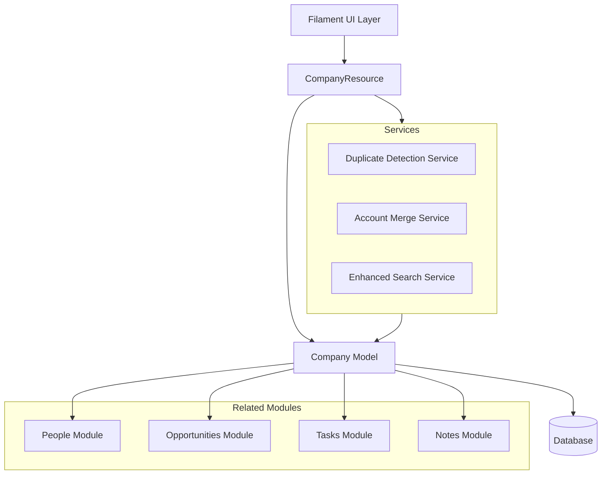

# Accounts Module Design Document

## Overview

The Accounts Module enhances the existing Company model to provide comprehensive account management capabilities. Rather than creating a new entity, this design extends the current Company infrastructure with additional fields, relationships, and features to support duplicate detection, merging, enhanced search, and improved integration with other modules.

The module leverages Laravel's Eloquent ORM, Filament's admin panel framework, and the existing custom fields system to provide a flexible, extensible solution that maintains consistency with the current codebase architecture.

## Architecture

### High-Level Architecture



### Component Interaction Flow

1. **User Interface**: Filament-based admin panel provides forms, tables, and actions
2. **Resource Layer**: CompanyResource handles routing, form schemas, and table configurations
3. **Service Layer**: Specialized services handle complex business logic (duplicate detection, merging)
4. **Model Layer**: Company model manages data persistence and relationships
5. **Database Layer**: PostgreSQL/MySQL stores account data with proper indexing

## Components and Interfaces

### 1. Enhanced Company Model

**Purpose**: Extend the existing Company model with additional fields and methods

**Key Additions**:
- Additional database fields: `website`, `industry`, `revenue`, `employee_count`, `description`
- Duplicate detection methods
- Merge operation support
- Enhanced relationship accessors

**Interface**:
```php
class Company extends Model
{
    // Existing traits and relationships remain
    
    // New methods
    public function findPotentialDuplicates(): Collection;
    public function calculateSimilarityScore(Company $other): float;
    public function mergeWith(Company $duplicate, array $fieldSelections): bool;
    public function getTotalPipelineValue(): float;
    public function getActivityTimeline(): Collection;
}
```

### 2. Duplicate Detection Service

**Purpose**: Identify potential duplicate account records using multiple matching strategies

**Responsibilities**:
- Name-based fuzzy matching
- Domain/website comparison
- Phone number normalization and matching
- Similarity score calculation

**Interface**:
```php
class DuplicateDetectionService
{
    public function findDuplicates(Company $company): Collection;
    public function calculateSimilarity(Company $a, Company $b): float;
    public function suggestMerge(Company $primary, Company $duplicate): array;
}
```

### 3. Account Merge Service

**Purpose**: Handle the complex process of merging duplicate account records

**Responsibilities**:
- Transfer relationships (people, opportunities, tasks, notes)
- Merge custom field data
- Preserve audit trail
- Handle rollback on failure

**Interface**:
```php
class AccountMergeService
{
    public function merge(Company $primary, Company $duplicate, array $fieldSelections): MergeResult;
    public function previewMerge(Company $primary, Company $duplicate): array;
    public function rollback(string $mergeId): bool;
}
```

### 4. Enhanced Company Resource

**Purpose**: Extend CompanyResource with new UI components and actions

**Key Additions**:
- Duplicate detection action
- Merge wizard action
- Enhanced search and filtering
- Activity timeline view
- Pipeline value display

### 5. Database Schema Extensions

**New Migration**: Add fields to companies table
```php
$table->string('website')->nullable();
$table->string('industry')->nullable();
$table->decimal('revenue', 15, 2)->nullable();
$table->integer('employee_count')->nullable();
$table->text('description')->nullable();
$table->index(['name', 'website']); // For duplicate detection
```

**New Table**: account_merges (audit trail)
```php
$table->id();
$table->foreignId('primary_company_id');
$table->foreignId('duplicate_company_id');
$table->foreignId('merged_by_user_id');
$table->json('field_selections');
$table->json('transferred_relationships');
$table->timestamps();
```

## Data Models

### Company Model Extensions

**Existing Fields** (from current schema):
- `id`: Primary key
- `team_id`: Foreign key to teams
- `creator_id`: Foreign key to users
- `account_owner_id`: Foreign key to users
- `name`: Company name
- `timestamps`: created_at, updated_at
- `deleted_at`: Soft delete timestamp

**New Fields**:
- `website`: Company website URL
- `industry`: Industry classification
- `revenue`: Annual revenue
- `employee_count`: Number of employees
- `description`: Company description

**Relationships**:
- `accountOwner()`: BelongsTo User
- `people()`: HasMany People
- `opportunities()`: HasMany Opportunity
- `tasks()`: MorphToMany Task
- `notes()`: MorphToMany Note (via HasNotes trait)
- `customFields()`: Via UsesCustomFields trait

### AccountMerge Model

**Purpose**: Track merge operations for audit and potential rollback

**Fields**:
- `id`: Primary key
- `primary_company_id`: The company that was kept
- `duplicate_company_id`: The company that was merged
- `merged_by_user_id`: User who performed the merge
- `field_selections`: JSON of which fields were selected from each company
- `transferred_relationships`: JSON of what was transferred
- `created_at`: When the merge occurred

## Correctness Properties

*A property is a characteristic or behavior that should hold true across all valid executions of a system-essentially, a formal statement about what the system should do. Properties serve as the bridge between human-readable specifications and machine-verifiable correctness guarantees.*


### Property Reflection

After reviewing all testable properties from the prework, several opportunities for consolidation emerge:

**Redundancies Identified**:
1. Properties 1.3, 2.2, 3.1, 3.2, 3.3, 4.4, 7.1, 8.1-8.4 all test data retrieval - these can be consolidated into comprehensive data retrieval properties
2. Properties 2.4 and 2.5 both test relationship cardinality - can be combined
3. Properties 3.1 and 3.5 both test chronological sorting - redundant
4. Properties 9.1, 9.2, 9.3, 9.5 all test search/filter functionality - can be consolidated
5. Properties 10.1, 10.3, 10.4, 10.5 all test export functionality - can be consolidated

**Consolidated Property Set**:
- Account CRUD operations (1.1, 1.2, 1.4)
- Relationship management (2.1, 2.3, 2.4, 2.5 combined)
- Data retrieval with relationships (consolidates 1.3, 2.2, 3.1-3.4, 4.4, 7.1, 8.1-8.4)
- Custom fields (4.1, 4.2, 4.5)
- Duplicate detection (5.1-5.5)
- Account merging (6.1-6.5)
- Pipeline calculations (7.3)
- Search and filtering (consolidates 9.1-9.5)
- Export functionality (consolidates 10.1-10.5)

### Correctness Properties

**Property 1: Account creation persistence**
*For any* valid account data (name, website, industry, revenue, employee_count), creating an account should result in a persisted record that can be retrieved with identical data.
**Validates: Requirements 1.1**

**Property 2: Account update persistence**
*For any* existing account and any valid field updates, updating the account should result in the changes being persisted and retrievable.
**Validates: Requirements 1.2**

**Property 3: Soft deletion preserves relationships**
*For any* account with related people, opportunities, tasks, and notes, soft deleting the account should mark it as deleted while preserving all related records and their relationships.
**Validates: Requirements 1.4**

**Property 4: Bidirectional relationship consistency**
*For any* account and person, creating a relationship from either direction (person.company = account OR account.people.add(person)) should result in the relationship being queryable from both sides.
**Validates: Requirements 2.1, 2.4, 2.5**

**Property 5: Relationship deletion preserves entities**
*For any* account-person relationship, removing the relationship should delete only the association while both the account and person records remain in the database.
**Validates: Requirements 2.3**

**Property 6: Complete data retrieval with relationships**
*For any* account with associated people, opportunities, tasks, notes, and custom fields, querying the account should return all standard fields, custom fields, and related entities with their complete data.
**Validates: Requirements 1.3, 2.2, 3.1, 3.2, 3.3, 4.4, 7.1, 8.1, 8.2, 8.3, 8.4**

**Property 7: Activity chronological ordering**
*For any* account with multiple notes and tasks created at different times, querying the activity history should return items sorted by creation date in descending order (most recent first).
**Validates: Requirements 3.1, 3.5**

**Property 8: Activity linkage**
*For any* account, creating a note or task associated with that account should result in the note/task appearing in the account's activity history.
**Validates: Requirements 3.4**

**Property 9: Custom field type validation**
*For any* custom field with a specific type (text, number, date, dropdown, checkbox), attempting to save invalid data should fail validation, while valid data should be accepted and persisted.
**Validates: Requirements 4.2**

**Property 10: Custom field lifecycle**
*For any* custom field, creating it should make it available for data entry, and deleting it should remove the field definition while archiving existing data.
**Validates: Requirements 4.1, 4.5**

**Property 11: Duplicate detection on creation**
*For any* new account with a name or website similar to an existing account, the duplicate detection should identify the existing account as a potential duplicate.
**Validates: Requirements 5.1, 5.2**

**Property 12: Fuzzy name matching**
*For any* two accounts with similar but not identical names (e.g., "Acme Corp" and "ACME Corporation"), the duplicate detection should identify them as potential duplicates with a similarity score above a threshold.
**Validates: Requirements 5.3, 5.4**

**Property 13: Similarity score calculation**
*For any* two accounts, calculating their similarity should produce a score between 0 and 1, where identical accounts score 1.0 and completely different accounts score close to 0.
**Validates: Requirements 5.5**

**Property 14: Merge preview completeness**
*For any* two accounts selected for merging, the merge preview should return all fields from both accounts for comparison.
**Validates: Requirements 6.1**

**Property 15: Merge relationship transfer**
*For any* primary account and duplicate account with associated people, opportunities, tasks, and notes, merging should transfer all relationships from the duplicate to the primary account.
**Validates: Requirements 6.2**

**Property 16: Merge audit trail**
*For any* completed merge operation, the system should create an AccountMerge record, soft delete the duplicate account, and preserve all transferred data.
**Validates: Requirements 6.3**

**Property 17: Merge data preservation**
*For any* two accounts with different non-null field values, merging should preserve all unique data based on field selections, with no data loss.
**Validates: Requirements 6.4**

**Property 18: Merge transaction rollback**
*For any* merge operation that encounters an error, all database changes should be rolled back, leaving both accounts in their original state.
**Validates: Requirements 6.5**

**Property 19: Pipeline value calculation**
*For any* account with multiple opportunities, the total pipeline value should equal the sum of all open opportunity amounts.
**Validates: Requirements 7.3**

**Property 20: Opportunity auto-linking**
*For any* opportunity created from an account context, the opportunity should automatically have its company_id set to that account.
**Validates: Requirements 7.2**

**Property 21: Opportunity filtering**
*For any* account with multiple opportunities, filtering by stage, owner, or date range should return only opportunities matching all applied criteria.
**Validates: Requirements 7.4**

**Property 22: Multi-field search**
*For any* search query, the system should return accounts where the query matches any of: name, website, phone, or custom field values.
**Validates: Requirements 9.1, 9.5**

**Property 23: Filter combination**
*For any* set of filter criteria (industry, revenue range, employee count, owner, custom fields), applying them should return only accounts matching all criteria.
**Validates: Requirements 9.2, 9.3**

**Property 24: Sort order correctness**
*For any* field and sort direction (ascending/descending), sorting accounts should order them correctly by that field's values.
**Validates: Requirements 9.4**

**Property 25: Export data completeness**
*For any* set of selected accounts (or filtered accounts), exporting should generate a file containing all selected records with both standard and custom field data.
**Validates: Requirements 10.1, 10.3, 10.4, 10.5**

**Property 26: Export format support**
*For any* export request, the system should successfully generate files in both CSV and Excel formats with identical data content.
**Validates: Requirements 10.2**

## Error Handling

### Validation Errors

**Account Creation/Update**:
- Required field validation (name is required)
- Format validation (website URL format, phone number format)
- Range validation (revenue and employee_count must be positive)
- Custom field type validation

**Error Response**: Return validation errors with specific field-level messages

### Duplicate Detection Errors

**Scenarios**:
- Database query failures during duplicate search
- Similarity calculation errors with malformed data

**Handling**: Log errors, return empty duplicate list, notify user of detection failure

### Merge Operation Errors

**Scenarios**:
- Attempting to merge an account with itself
- Merge operation fails mid-transaction
- Invalid field selections
- Database constraint violations

**Handling**: 
- Validate merge preconditions before starting
- Wrap entire merge in database transaction
- Rollback on any error
- Preserve detailed error logs for debugging
- Return user-friendly error messages

### Relationship Errors

**Scenarios**:
- Attempting to associate deleted records
- Circular relationship attempts
- Foreign key constraint violations

**Handling**: Validate relationships before creation, return specific error messages

### Export Errors

**Scenarios**:
- File generation failures
- Insufficient permissions
- Memory limits with large exports

**Handling**: 
- Stream large exports to avoid memory issues
- Provide progress feedback
- Return partial results with error notification if needed

## Testing Strategy

### Unit Testing

The testing approach will use **Pest PHP** (already configured in the project) for both unit and property-based tests.

**Unit Test Coverage**:
- Service method functionality (DuplicateDetectionService, AccountMergeService)
- Model method behavior (findPotentialDuplicates, calculateSimilarityScore, mergeWith)
- Validation rules for new fields
- Specific edge cases:
  - Merging accounts with no relationships
  - Duplicate detection with empty fields
  - Export with no results
  - Custom field deletion with existing data

**Example Unit Tests**:
```php
test('merge service transfers all relationships', function () {
    $primary = Company::factory()->create();
    $duplicate = Company::factory()
        ->has(People::factory()->count(3))
        ->has(Opportunity::factory()->count(2))
        ->create();
    
    $service = app(AccountMergeService::class);
    $result = $service->merge($primary, $duplicate, []);
    
    expect($primary->people)->toHaveCount(3);
    expect($primary->opportunities)->toHaveCount(2);
    expect($duplicate->fresh()->trashed())->toBeTrue();
});
```

### Property-Based Testing

**Library**: Use **Pest PHP with Property Testing** plugin (or integrate a PHP property testing library like `eris/eris`)

**Configuration**: Each property test should run a minimum of 100 iterations to ensure comprehensive coverage across random inputs.

**Property Test Tagging**: Each property-based test MUST include a comment tag in this exact format:
```php
// Feature: accounts-module, Property 1: Account creation persistence
```

**Property Test Coverage**:

Each correctness property from the design document will be implemented as a single property-based test. The tests will generate random valid inputs and verify the properties hold across all generated cases.

**Example Property Tests**:

```php
// Feature: accounts-module, Property 1: Account creation persistence
test('account creation persists data correctly', function () {
    // Generate random account data
    $data = [
        'name' => fake()->company(),
        'website' => fake()->url(),
        'industry' => fake()->word(),
        'revenue' => fake()->randomFloat(2, 1000, 10000000),
        'employee_count' => fake()->numberBetween(1, 10000),
    ];
    
    $account = Company::create($data);
    $retrieved = Company::find($account->id);
    
    expect($retrieved->name)->toBe($data['name']);
    expect($retrieved->website)->toBe($data['website']);
    expect($retrieved->industry)->toBe($data['industry']);
})->repeat(100);

// Feature: accounts-module, Property 12: Fuzzy name matching
test('duplicate detection identifies similar names', function () {
    $baseName = fake()->company();
    $variations = [
        strtoupper($baseName),
        strtolower($baseName),
        $baseName . ' Inc',
        $baseName . ' Corporation',
    ];
    
    $original = Company::factory()->create(['name' => $baseName]);
    
    foreach ($variations as $variation) {
        $similar = Company::factory()->create(['name' => $variation]);
        $service = app(DuplicateDetectionService::class);
        $duplicates = $service->findDuplicates($similar);
        
        expect($duplicates)->toContain($original);
    }
})->repeat(100);
```

**Generator Strategies**:
- Use Laravel factories for generating valid model data
- Create custom generators for edge cases (empty strings, very long strings, special characters)
- Generate realistic variations for duplicate detection tests (case changes, punctuation, abbreviations)
- Generate boundary values for numeric fields (zero, negative, very large numbers)

### Integration Testing

**Scope**: Test interactions between components
- Filament resource actions triggering service methods
- Database transactions during merge operations
- Event dispatching and listener execution
- Custom field integration with account CRUD

### Test Organization

```
tests/
├── Unit/
│   ├── Services/
│   │   ├── DuplicateDetectionServiceTest.php
│   │   └── AccountMergeServiceTest.php
│   └── Models/
│       └── CompanyTest.php
├── Feature/
│   ├── Filament/
│   │   ├── CompanyResourceTest.php
│   │   ├── DuplicateDetectionActionTest.php
│   │   └── MergeAccountsActionTest.php
│   └── AccountsModule/
│       ├── AccountCreationTest.php
│       ├── AccountRelationshipsTest.php
│       ├── DuplicateDetectionTest.php
│       ├── AccountMergingTest.php
│       └── AccountExportTest.php
└── Property/
    └── AccountsModulePropertiesTest.php
```

## Implementation Notes

### Leveraging Existing Infrastructure

1. **Custom Fields**: The system already has a robust custom fields implementation via the `Relaticle\CustomFields` package. No new custom field system needs to be built.

2. **Soft Deletes**: The Company model already uses `SoftDeletes` trait, so deletion behavior is already implemented.

3. **Team Scoping**: The `HasTeam` trait already provides multi-tenancy, so accounts are automatically scoped to teams.

4. **Media Library**: The `InteractsWithMedia` trait is already on Company for logo management.

5. **Relationships**: Most relationships (people, opportunities, tasks, notes) already exist and just need to be leveraged in the UI.

### New Components to Build

1. **Database Migration**: Add new fields (website, industry, revenue, employee_count, description)
2. **DuplicateDetectionService**: New service for finding similar accounts
3. **AccountMergeService**: New service for merging accounts
4. **AccountMerge Model**: New model for audit trail
5. **Filament Actions**: Duplicate detection and merge wizard actions
6. **Enhanced CompanyResource**: Add new fields, actions, and views

### Technology Stack

- **Framework**: Laravel 11
- **Admin Panel**: Filament 3
- **Database**: PostgreSQL/MySQL with full-text search support
- **Testing**: Pest PHP
- **Property Testing**: Pest with property testing support or eris/eris
- **String Similarity**: `similar_text()` or Levenshtein distance for fuzzy matching
- **Export**: Filament's built-in export functionality (already used in CompanyExporter)

### Performance Considerations

1. **Duplicate Detection**: 
   - Index on name and website fields
   - Limit duplicate search to same team
   - Cache similarity calculations for frequently compared accounts

2. **Activity Timeline**:
   - Eager load relationships to avoid N+1 queries
   - Paginate activity history for accounts with many activities

3. **Export**:
   - Use chunking for large exports
   - Queue export jobs for very large datasets

4. **Search**:
   - Use database full-text search indexes
   - Consider Laravel Scout for advanced search if needed

### Security Considerations

1. **Authorization**: Use existing Filament policies to ensure users can only access accounts in their team
2. **Merge Permissions**: Restrict merge operations to users with appropriate permissions
3. **Audit Trail**: Log all merge operations with user ID and timestamp
4. **Data Validation**: Sanitize all inputs to prevent injection attacks
5. **Export Permissions**: Ensure users can only export accounts they have access to
