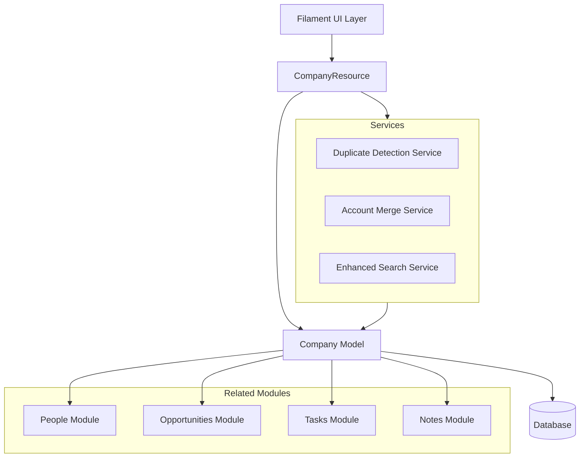
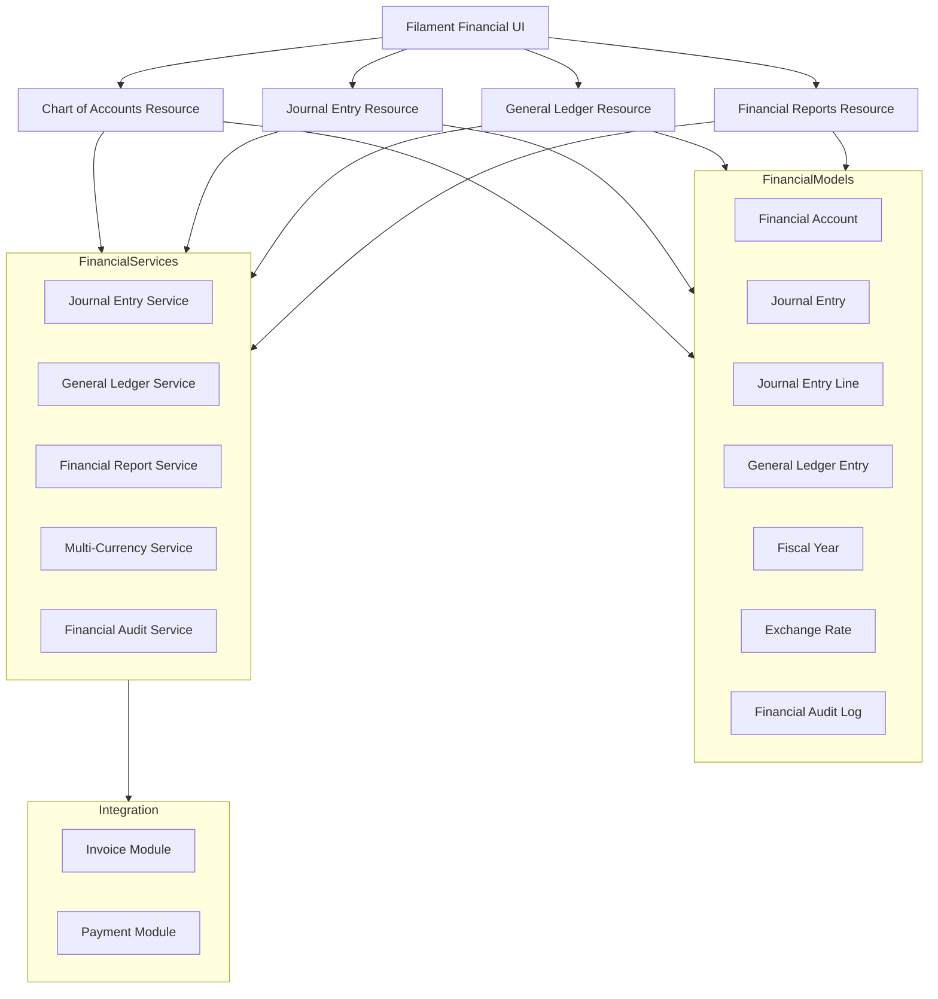

# Accounts Module Design Document

## Overview

The Accounts Module enhances the existing Company model to provide comprehensive account management capabilities. Rather than creating a new entity, this design extends the current Company infrastructure with additional fields, relationships, and features to support duplicate detection, merging, enhanced search, and improved integration with other modules.

The module leverages Laravel's Eloquent ORM, Filament's admin panel framework, and the existing custom fields system to provide a flexible, extensible solution that maintains consistency with the current codebase architecture.

## Architecture

### High-Level Architecture



### Component Interaction Flow

1. **User Interface**: Filament-based admin panel provides forms, tables, and actions
2. **Resource Layer**: CompanyResource handles routing, form schemas, and table configurations
3. **Service Layer**: Specialized services handle complex business logic (duplicate detection, merging)
4. **Model Layer**: Company model manages data persistence and relationships
5. **Database Layer**: PostgreSQL/MySQL stores account data with proper indexing

## Components and Interfaces

### 1. Enhanced Company Model

**Purpose**: Extend the existing Company model with additional fields and methods

**Key Additions**:
- Additional database fields: `website`, `industry`, `revenue`, `employee_count`, `description`, `account_type`, `currency_code`, `social_links`, `parent_company_id`
- Duplicate detection methods
- Merge operation support
- Enhanced relationship accessors
- Account hierarchy methods (parent/child relationships)
- Account team management
- Social media profile management
- Document attachment support via media library

**Interface**:
```php
class Company extends Model
{
    // Existing traits and relationships remain
    
    // Duplicate detection and merging
    public function findPotentialDuplicates(): Collection;
    public function calculateSimilarityScore(Company $other): float;
    public function mergeWith(Company $duplicate, array $fieldSelections): bool;
    
    // Financial and pipeline
    public function getTotalPipelineValue(): float;
    
    // Activity and timeline
    public function getActivityTimeline(int $limit = 25): Collection;
    
    // Account hierarchy
    public function parentCompany(): BelongsTo;
    public function childCompanies(): HasMany;
    public function wouldCreateCycle(?int $parentId): bool;
    
    // Account team
    public function accountOwner(): BelongsTo;
    public function accountTeam(): BelongsToMany;
    public function accountTeamMembers(): HasMany;
    public function ensureAccountOwnerOnTeam(): void;
    
    // Document management
    public function attachments(): MorphMany;
    public function registerMediaCollections(): void;
}
```

### 2. Duplicate Detection Service

**Purpose**: Identify potential duplicate account records using multiple matching strategies

**Responsibilities**:
- Name-based fuzzy matching
- Domain/website comparison
- Phone number normalization and matching
- Similarity score calculation

**Interface**:
```php
class DuplicateDetectionService
{
    public function findDuplicates(Company $company): Collection;
    public function calculateSimilarity(Company $a, Company $b): float;
    public function suggestMerge(Company $primary, Company $duplicate): array;
}
```

### 3. Account Merge Service

**Purpose**: Handle the complex process of merging duplicate account records

**Responsibilities**:
- Transfer relationships (people, opportunities, tasks, notes)
- Merge custom field data
- Preserve audit trail
- Handle rollback on failure

**Interface**:
```php
class AccountMergeService
{
    public function merge(Company $primary, Company $duplicate, array $fieldSelections): MergeResult;
    public function previewMerge(Company $primary, Company $duplicate): array;
    public function rollback(string $mergeId): bool;
}
```

### 4. Enhanced Company Resource

**Purpose**: Extend CompanyResource with new UI components and actions

**Key Additions**:
- Duplicate detection action
- Merge wizard action
- Enhanced search and filtering
- Activity timeline view
- Pipeline value display

### 5. AccountTeamMember Model

**Purpose**: Manage team collaboration on accounts with roles and access levels

**Responsibilities**:
- Track which users are assigned to which accounts
- Define roles (Owner, Account Manager, Sales Rep, Support Contact, Technical Lead)
- Define access levels (View, Edit, Manage)
- Maintain team membership history

**Interface**:
```php
class AccountTeamMember extends Model
{
    public function company(): BelongsTo;
    public function user(): BelongsTo;
    public function team(): BelongsTo;
    
    // Enums
    public AccountTeamRole $role;
    public AccountTeamAccessLevel $access_level;
}
```

### 6. Database Schema Extensions

**New Migration**: Add fields to companies table
```php
$table->string('website')->nullable();
$table->string('industry')->nullable();
$table->decimal('revenue', 15, 2)->nullable();
$table->integer('employee_count')->nullable();
$table->text('description')->nullable();
$table->string('account_type')->nullable(); // Customer, Prospect, Partner, etc.
$table->string('currency_code', 3)->default('USD');
$table->json('social_links')->nullable(); // LinkedIn, Twitter, Facebook, Instagram
$table->foreignId('parent_company_id')->nullable()->constrained('companies');
$table->index(['name', 'website']); // For duplicate detection
$table->index('parent_company_id'); // For hierarchy queries
```

**New Table**: account_merges (audit trail)
```php
$table->id();
$table->foreignId('primary_company_id');
$table->foreignId('duplicate_company_id');
$table->foreignId('merged_by_user_id');
$table->json('field_selections');
$table->json('transferred_relationships');
$table->timestamps();
```

**New Table**: account_team_members (already exists)
```php
$table->id();
$table->foreignId('company_id')->constrained()->cascadeOnDelete();
$table->foreignId('user_id')->constrained()->cascadeOnDelete();
$table->foreignId('team_id')->constrained()->cascadeOnDelete();
$table->string('role'); // Owner, Account Manager, Sales Rep, etc.
$table->string('access_level'); // View, Edit, Manage
$table->timestamps();
$table->unique(['company_id', 'user_id']);
```

## Data Models

### Company Model Extensions

**Existing Fields** (from current schema):
- `id`: Primary key
- `team_id`: Foreign key to teams
- `creator_id`: Foreign key to users
- `account_owner_id`: Foreign key to users
- `name`: Company name
- `timestamps`: created_at, updated_at
- `deleted_at`: Soft delete timestamp

**New Fields**:
- `website`: Company website URL
- `industry`: Industry classification (enum)
- `revenue`: Annual revenue (decimal)
- `employee_count`: Number of employees (integer)
- `description`: Company description (text)
- `account_type`: Account classification (enum: Customer, Prospect, Partner, Competitor, Investor, Reseller)
- `currency_code`: Operating currency (ISO code, default: USD)
- `social_links`: JSON array of social media profiles
- `parent_company_id`: Foreign key to parent company for hierarchies

**Relationships**:
- `accountOwner()`: BelongsTo User
- `accountTeam()`: BelongsToMany User (via account_team_members pivot)
- `accountTeamMembers()`: HasMany AccountTeamMember
- `parentCompany()`: BelongsTo Company
- `childCompanies()`: HasMany Company
- `people()`: HasMany People
- `opportunities()`: HasMany Opportunity
- `tasks()`: MorphToMany Task
- `notes()`: MorphToMany Note (via HasNotes trait)
- `customFields()`: Via UsesCustomFields trait

### AccountMerge Model

**Purpose**: Track merge operations for audit and potential rollback

**Fields**:
- `id`: Primary key
- `primary_company_id`: The company that was kept
- `duplicate_company_id`: The company that was merged
- `merged_by_user_id`: User who performed the merge
- `field_selections`: JSON of which fields were selected from each company
- `transferred_relationships`: JSON of what was transferred
- `created_at`: When the merge occurred

## Correctness Properties

*A property is a characteristic or behavior that should hold true across all valid executions of a system-essentially, a formal statement about what the system should do. Properties serve as the bridge between human-readable specifications and machine-verifiable correctness guarantees.*


### Property Reflection

After reviewing all testable properties from the prework, several opportunities for consolidation emerge:

**Redundancies Identified**:
1. Properties 1.3, 2.2, 3.1, 3.2, 3.3, 4.4, 7.1, 8.1-8.4 all test data retrieval - these can be consolidated into comprehensive data retrieval properties
2. Properties 2.4 and 2.5 both test relationship cardinality - can be combined
3. Properties 3.1 and 3.5 both test chronological sorting - redundant
4. Properties 9.1, 9.2, 9.3, 9.5 all test search/filter functionality - can be consolidated
5. Properties 10.1, 10.3, 10.4, 10.5 all test export functionality - can be consolidated

**Consolidated Property Set**:
- Account CRUD operations (1.1, 1.2, 1.4)
- Relationship management (2.1, 2.3, 2.4, 2.5 combined)
- Data retrieval with relationships (consolidates 1.3, 2.2, 3.1-3.4, 4.4, 7.1, 8.1-8.4)
- Custom fields (4.1, 4.2, 4.5)
- Duplicate detection (5.1-5.5)
- Account merging (6.1-6.5)
- Pipeline calculations (7.3)
- Search and filtering (consolidates 9.1-9.5)
- Export functionality (consolidates 10.1-10.5)

### Correctness Properties

**Property 1: Account creation persistence**
*For any* valid account data (name, website, industry, revenue, employee_count), creating an account should result in a persisted record that can be retrieved with identical data.
**Validates: Requirements 1.1**

**Property 2: Account update persistence**
*For any* existing account and any valid field updates, updating the account should result in the changes being persisted and retrievable.
**Validates: Requirements 1.2**

**Property 3: Soft deletion preserves relationships**
*For any* account with related people, opportunities, tasks, and notes, soft deleting the account should mark it as deleted while preserving all related records and their relationships.
**Validates: Requirements 1.4**

**Property 4: Bidirectional relationship consistency**
*For any* account and person, creating a relationship from either direction (person.company = account OR account.people.add(person)) should result in the relationship being queryable from both sides.
**Validates: Requirements 2.1, 2.4, 2.5**

**Property 5: Relationship deletion preserves entities**
*For any* account-person relationship, removing the relationship should delete only the association while both the account and person records remain in the database.
**Validates: Requirements 2.3**

**Property 6: Complete data retrieval with relationships**
*For any* account with associated people, opportunities, tasks, notes, and custom fields, querying the account should return all standard fields, custom fields, and related entities with their complete data.
**Validates: Requirements 1.3, 2.2, 3.1, 3.2, 3.3, 4.4, 7.1, 8.1, 8.2, 8.3, 8.4**

**Property 7: Activity chronological ordering**
*For any* account with multiple notes and tasks created at different times, querying the activity history should return items sorted by creation date in descending order (most recent first).
**Validates: Requirements 3.1, 3.5**

**Property 8: Activity linkage**
*For any* account, creating a note or task associated with that account should result in the note/task appearing in the account's activity history.
**Validates: Requirements 3.4**

**Property 9: Custom field type validation**
*For any* custom field with a specific type (text, number, date, dropdown, checkbox), attempting to save invalid data should fail validation, while valid data should be accepted and persisted.
**Validates: Requirements 4.2**

**Property 10: Custom field lifecycle**
*For any* custom field, creating it should make it available for data entry, and deleting it should remove the field definition while archiving existing data.
**Validates: Requirements 4.1, 4.5**

**Property 11: Duplicate detection on creation**
*For any* new account with a name or website similar to an existing account, the duplicate detection should identify the existing account as a potential duplicate.
**Validates: Requirements 5.1, 5.2**

**Property 12: Fuzzy name matching**
*For any* two accounts with similar but not identical names (e.g., "Acme Corp" and "ACME Corporation"), the duplicate detection should identify them as potential duplicates with a similarity score above a threshold.
**Validates: Requirements 5.3, 5.4**

**Property 13: Similarity score calculation**
*For any* two accounts, calculating their similarity should produce a score between 0 and 1, where identical accounts score 1.0 and completely different accounts score close to 0.
**Validates: Requirements 5.5**

**Property 14: Merge preview completeness**
*For any* two accounts selected for merging, the merge preview should return all fields from both accounts for comparison.
**Validates: Requirements 6.1**

**Property 15: Merge relationship transfer**
*For any* primary account and duplicate account with associated people, opportunities, tasks, and notes, merging should transfer all relationships from the duplicate to the primary account.
**Validates: Requirements 6.2**

**Property 16: Merge audit trail**
*For any* completed merge operation, the system should create an AccountMerge record, soft delete the duplicate account, and preserve all transferred data.
**Validates: Requirements 6.3**

**Property 17: Merge data preservation**
*For any* two accounts with different non-null field values, merging should preserve all unique data based on field selections, with no data loss.
**Validates: Requirements 6.4**

**Property 18: Merge transaction rollback**
*For any* merge operation that encounters an error, all database changes should be rolled back, leaving both accounts in their original state.
**Validates: Requirements 6.5**

**Property 19: Pipeline value calculation**
*For any* account with multiple opportunities, the total pipeline value should equal the sum of all open opportunity amounts.
**Validates: Requirements 7.3**

**Property 20: Opportunity auto-linking**
*For any* opportunity created from an account context, the opportunity should automatically have its company_id set to that account.
**Validates: Requirements 7.2**

**Property 21: Opportunity filtering**
*For any* account with multiple opportunities, filtering by stage, owner, or date range should return only opportunities matching all applied criteria.
**Validates: Requirements 7.4**

**Property 22: Multi-field search**
*For any* search query, the system should return accounts where the query matches any of: name, website, phone, or custom field values.
**Validates: Requirements 9.1, 9.5**

**Property 23: Filter combination**
*For any* set of filter criteria (industry, revenue range, employee count, owner, custom fields), applying them should return only accounts matching all criteria.
**Validates: Requirements 9.2, 9.3**

**Property 24: Sort order correctness**
*For any* field and sort direction (ascending/descending), sorting accounts should order them correctly by that field's values.
**Validates: Requirements 9.4**

**Property 25: Export data completeness**
*For any* set of selected accounts (or filtered accounts), exporting should generate a file containing all selected records with both standard and custom field data.
**Validates: Requirements 10.1, 10.3, 10.4, 10.5**

**Property 26: Export format support**
*For any* export request, the system should successfully generate files in both CSV and Excel formats with identical data content.
**Validates: Requirements 10.2**

**Property 27: Account type persistence and filtering**
*For any* account with an assigned account type (Customer, Prospect, Partner, etc.), the type should be persisted, retrievable, and filterable across all accounts.
**Validates: Requirements 11.1, 11.2**

**Property 28: Account type change audit trail**
*For any* account where the account type is changed, the system should update the account and preserve the change in the activity history.
**Validates: Requirements 11.4**

**Property 29: Account team member assignment**
*For any* account and user, adding the user to the account team with a specific role should create an AccountTeamMember record that is queryable from both the account and user perspectives.
**Validates: Requirements 12.1, 12.2**

**Property 30: Account team member removal preserves history**
*For any* account team member, removing them from the account should delete the team membership while preserving all their historical activities and contributions.
**Validates: Requirements 12.4**

**Property 31: Account owner team synchronization**
*For any* account, when the account owner changes, the system should automatically update the account team to ensure the new owner has Owner role and Manage access level.
**Validates: Requirements 12.5**

**Property 32: Currency code persistence**
*For any* account with a designated currency code, the currency should be persisted, retrievable, and used for displaying financial data in the correct currency.
**Validates: Requirements 13.1, 13.2**

**Property 33: Social media profile storage**
*For any* account with social media profile URLs, the profiles should be stored in a structured format, retrievable, and displayable with appropriate validation.
**Validates: Requirements 14.1, 14.2, 14.3**

**Property 34: Document attachment lifecycle**
*For any* document uploaded to an account, the system should store it with metadata (filename, size, upload date, uploader), make it retrievable, and allow deletion with appropriate permissions.
**Validates: Requirements 15.1, 15.2, 15.5**

**Property 35: Document download logging**
*For any* document attached to an account, downloading the document should serve the file and log the download activity.
**Validates: Requirements 15.4**

**Property 36: Hierarchy cycle prevention**
*For any* account and potential parent account, the system should prevent creating a parent-child relationship if it would create a circular reference (account cannot be its own ancestor).
**Validates: Requirements 16.3**

**Property 37: Hierarchy relationship persistence**
*For any* account with a parent account, the parent-child relationship should be persisted, queryable from both directions, and displayable in a hierarchical view.
**Validates: Requirements 16.1, 16.2**

**Property 38: Hierarchy aggregation**
*For any* parent account with child accounts, the system should provide the ability to aggregate data (opportunities, revenue, activities) from all child accounts.
**Validates: Requirements 16.4**

## Error Handling

### Validation Errors

**Account Creation/Update**:
- Required field validation (name is required)
- Format validation (website URL format, phone number format, social media URLs)
- Range validation (revenue and employee_count must be positive)
- Custom field type validation
- Account type enum validation
- Currency code validation (must be valid ISO code)
- Parent company validation (cannot create cycles)

**Error Response**: Return validation errors with specific field-level messages

### Duplicate Detection Errors

**Scenarios**:
- Database query failures during duplicate search
- Similarity calculation errors with malformed data

**Handling**: Log errors, return empty duplicate list, notify user of detection failure

### Merge Operation Errors

**Scenarios**:
- Attempting to merge an account with itself
- Merge operation fails mid-transaction
- Invalid field selections
- Database constraint violations

**Handling**: 
- Validate merge preconditions before starting
- Wrap entire merge in database transaction
- Rollback on any error
- Preserve detailed error logs for debugging
- Return user-friendly error messages

### Relationship Errors

**Scenarios**:
- Attempting to associate deleted records
- Circular relationship attempts (account hierarchies)
- Foreign key constraint violations
- Duplicate team member assignments
- Invalid role or access level assignments

**Handling**: Validate relationships before creation, return specific error messages

### Account Hierarchy Errors

**Scenarios**:
- Attempting to set an account as its own parent
- Creating circular parent-child relationships
- Setting a child account as parent of its ancestor

**Handling**:
- Use `wouldCreateCycle()` method to validate before saving
- Return clear error message explaining the circular reference
- Suggest alternative hierarchy structures

### Account Team Errors

**Scenarios**:
- Adding a user who doesn't belong to the account's team
- Assigning invalid roles or access levels
- Removing the account owner from the team
- Duplicate team member assignments

**Handling**:
- Validate team membership before assignment
- Prevent removal of account owner
- Return specific error messages for each scenario

### Document Attachment Errors

**Scenarios**:
- Uploading files exceeding size limits
- Uploading unsupported file types
- Insufficient storage space
- Permission denied for document operations

**Handling**:
- Validate file size and type before upload
- Return clear error messages with size/type requirements
- Check permissions before allowing upload/download/delete operations

### Export Errors

**Scenarios**:
- File generation failures
- Insufficient permissions
- Memory limits with large exports

**Handling**: 
- Stream large exports to avoid memory issues
- Provide progress feedback
- Return partial results with error notification if needed

## Testing Strategy

### Unit Testing

The testing approach will use **Pest PHP** (already configured in the project) for both unit and property-based tests.

**Unit Test Coverage**:
- Service method functionality (DuplicateDetectionService, AccountMergeService)
- Model method behavior (findPotentialDuplicates, calculateSimilarityScore, mergeWith, wouldCreateCycle)
- Validation rules for new fields (account_type, currency_code, social_links, parent_company_id)
- Account team management (ensureAccountOwnerOnTeam, team member assignment/removal)
- Account hierarchy operations (parent/child relationships, cycle detection)
- Document attachment operations (upload, download, delete)
- Social media profile validation and storage
- Currency code validation
- Specific edge cases:
  - Merging accounts with no relationships
  - Duplicate detection with empty fields
  - Export with no results
  - Custom field deletion with existing data
  - Circular hierarchy prevention
  - Account owner team synchronization
  - Document upload with invalid file types

**Example Unit Tests**:
```php
test('merge service transfers all relationships', function () {
    $primary = Company::factory()->create();
    $duplicate = Company::factory()
        ->has(People::factory()->count(3))
        ->has(Opportunity::factory()->count(2))
        ->create();
    
    $service = app(AccountMergeService::class);
    $result = $service->merge($primary, $duplicate, []);
    
    expect($primary->people)->toHaveCount(3);
    expect($primary->opportunities)->toHaveCount(2);
    expect($duplicate->fresh()->trashed())->toBeTrue();
});
```

### Property-Based Testing

**Library**: Use **Pest PHP with Property Testing** plugin (or integrate a PHP property testing library like `eris/eris`)

**Configuration**: Each property test should run a minimum of 100 iterations to ensure comprehensive coverage across random inputs.

**Property Test Tagging**: Each property-based test MUST include a comment tag in this exact format:
```php
// Feature: accounts-module, Property 1: Account creation persistence
```

**Property Test Coverage**:

Each correctness property from the design document will be implemented as a single property-based test. The tests will generate random valid inputs and verify the properties hold across all generated cases.

**Example Property Tests**:

```php
// Feature: accounts-module, Property 1: Account creation persistence
test('account creation persists data correctly', function () {
    // Generate random account data
    $data = [
        'name' => fake()->company(),
        'website' => fake()->url(),
        'industry' => fake()->word(),
        'revenue' => fake()->randomFloat(2, 1000, 10000000),
        'employee_count' => fake()->numberBetween(1, 10000),
    ];
    
    $account = Company::create($data);
    $retrieved = Company::find($account->id);
    
    expect($retrieved->name)->toBe($data['name']);
    expect($retrieved->website)->toBe($data['website']);
    expect($retrieved->industry)->toBe($data['industry']);
})->repeat(100);

// Feature: accounts-module, Property 12: Fuzzy name matching
test('duplicate detection identifies similar names', function () {
    $baseName = fake()->company();
    $variations = [
        strtoupper($baseName),
        strtolower($baseName),
        $baseName . ' Inc',
        $baseName . ' Corporation',
    ];
    
    $original = Company::factory()->create(['name' => $baseName]);
    
    foreach ($variations as $variation) {
        $similar = Company::factory()->create(['name' => $variation]);
        $service = app(DuplicateDetectionService::class);
        $duplicates = $service->findDuplicates($similar);
        
        expect($duplicates)->toContain($original);
    }
})->repeat(100);
```

**Generator Strategies**:
- Use Laravel factories for generating valid model data
- Create custom generators for edge cases (empty strings, very long strings, special characters)
- Generate realistic variations for duplicate detection tests (case changes, punctuation, abbreviations)
- Generate boundary values for numeric fields (zero, negative, very large numbers)

### Integration Testing

**Scope**: Test interactions between components
- Filament resource actions triggering service methods
- Database transactions during merge operations
- Event dispatching and listener execution
- Custom field integration with account CRUD

### Test Organization

```
tests/
├── Unit/
│   ├── Services/
│   │   ├── DuplicateDetectionServiceTest.php
│   │   └── AccountMergeServiceTest.php
│   └── Models/
│       └── CompanyTest.php
├── Feature/
│   ├── Filament/
│   │   ├── CompanyResourceTest.php
│   │   ├── DuplicateDetectionActionTest.php
│   │   └── MergeAccountsActionTest.php
│   └── AccountsModule/
│       ├── AccountCreationTest.php
│       ├── AccountRelationshipsTest.php
│       ├── DuplicateDetectionTest.php
│       ├── AccountMergingTest.php
│       └── AccountExportTest.php
└── Property/
    └── AccountsModulePropertiesTest.php
```

## Implementation Notes

### Leveraging Existing Infrastructure

1. **Custom Fields**: The system already has a robust custom fields implementation via the `Relaticle\CustomFields` package. No new custom field system needs to be built.

2. **Soft Deletes**: The Company model already uses `SoftDeletes` trait, so deletion behavior is already implemented.

3. **Team Scoping**: The `HasTeam` trait already provides multi-tenancy, so accounts are automatically scoped to teams.

4. **Media Library**: The `InteractsWithMedia` trait is already on Company for logo management.

5. **Relationships**: Most relationships (people, opportunities, tasks, notes) already exist and just need to be leveraged in the UI.

### New Components to Build

1. **Database Migration**: Add new fields (website, industry, revenue, employee_count, description, account_type, currency_code, social_links, parent_company_id)
2. **DuplicateDetectionService**: New service for finding similar accounts (✅ Completed)
3. **AccountMergeService**: New service for merging accounts (✅ Completed)
4. **AccountMerge Model**: New model for audit trail (✅ Completed)
5. **AccountTeamMember Model**: Model for account team collaboration (✅ Already exists)
6. **Filament Actions**: 
   - Duplicate detection action
   - Merge wizard action
   - Add team member action
   - Upload document action
7. **Filament Form Components**:
   - Account type selector
   - Currency selector
   - Social media profile inputs
   - Parent company selector with cycle validation
   - Account team management interface
8. **Filament Filters**:
   - Account type filter
   - Currency filter
   - Hierarchy level filter
6. **Enhanced CompanyResource**: Add new fields, actions, and views

### Technology Stack

- **Framework**: Laravel 11
- **Admin Panel**: Filament 4.3
- **Database**: PostgreSQL/MySQL with full-text search support
- **Testing**: Pest PHP
- **Property Testing**: Pest with property testing support or eris/eris
- **String Similarity**: `similar_text()` or Levenshtein distance for fuzzy matching
- **Export**: Filament's built-in export functionality (already used in CompanyExporter)

### Performance Considerations

1. **Duplicate Detection**: 
   - Index on name and website fields
   - Limit duplicate search to same team
   - Cache similarity calculations for frequently compared accounts

2. **Activity Timeline**:
   - Eager load relationships to avoid N+1 queries
   - Paginate activity history for accounts with many activities

3. **Export**:
   - Use chunking for large exports
   - Queue export jobs for very large datasets

4. **Search**:
   - Use database full-text search indexes
   - Consider Laravel Scout for advanced search if needed

### Security Considerations

1. **Authorization**: Use existing Filament policies to ensure users can only access accounts in their team
2. **Merge Permissions**: Restrict merge operations to users with appropriate permissions
3. **Audit Trail**: Log all merge operations with user ID and timestamp
4. **Data Validation**: Sanitize all inputs to prevent injection attacks
5. **Export Permissions**: Ensure users can only export accounts they have access to

## Financial Accounting Architecture

### High-Level Financial Architecture



### Financial Component Flow

1. **Chart of Accounts Management**: Create and organize financial accounts in hierarchical structure
2. **Journal Entry Processing**: Record transactions with automatic debit/credit validation
3. **General Ledger Updates**: Automatically update account balances from journal entries
4. **Multi-Currency Processing**: Handle foreign currency transactions with exchange rates
5. **Financial Reporting**: Generate standard financial statements and custom reports
6. **Audit Trail**: Comprehensive logging of all financial data changes
7. **Integration**: Automatic journal entry generation from invoices and payments

## Financial Components and Interfaces

### 1. Financial Account Model

**Purpose**: Represent accounts in the chart of accounts with hierarchical structure

**Key Features**:
- Unique account codes with validation
- Account categories (Assets, Liabilities, Equity, Revenue, Expenses)
- Parent-child relationships for sub-accounts
- Balance tracking and calculation
- Transaction history prevention for deletion

**Interface**:
```php
class FinancialAccount extends Model
{
    use HasTeam, SoftDeletes, HasAuditTrail;
    
    // Account structure
    public function parentAccount(): BelongsTo;
    public function childAccounts(): HasMany;
    public function wouldCreateCycle(?int $parentId): bool;
    
    // Balance and transactions
    public function getCurrentBalance(): Money;
    public function getBalanceAsOf(Carbon $date): Money;
    public function hasTransactionHistory(): bool;
    public function generalLedgerEntries(): HasMany;
    
    // Validation
    public function isValidAccountCode(string $code): bool;
    public function canBeDeleted(): bool;
    
    // Enums
    public AccountCategory $category;
    public AccountType $account_type;
}
```

### 2. Journal Entry Model

**Purpose**: Record financial transactions with double-entry bookkeeping

**Key Features**:
- Automatic sequential numbering
- Debit/credit balance validation
- Multi-currency support
- Posting status management
- Audit trail integration

**Interface**:
```php
class JournalEntry extends Model
{
    use HasTeam, SoftDeletes, HasAuditTrail;
    
    // Relationships
    public function journalEntryLines(): HasMany;
    public function createdBy(): BelongsTo;
    public function fiscalYear(): BelongsTo;
    
    // Validation and processing
    public function isBalanced(): bool;
    public function getTotalDebits(): Money;
    public function getTotalCredits(): Money;
    public function post(): bool;
    public function reverse(): JournalEntry;
    
    // Status management
    public function canBeEdited(): bool;
    public function canBeDeleted(): bool;
    
    // Enums
    public JournalEntryStatus $status;
    public JournalEntryType $entry_type;
}
```

### 3. Journal Entry Line Model

**Purpose**: Individual debit/credit lines within journal entries

**Interface**:
```php
class JournalEntryLine extends Model
{
    use HasTeam, HasAuditTrail;
    
    // Relationships
    public function journalEntry(): BelongsTo;
    public function financialAccount(): BelongsTo;
    
    // Currency handling
    public function getAmountInBaseCurrency(): Money;
    public function getExchangeRate(): ?float;
    
    // Validation
    public function isDebit(): bool;
    public function isCredit(): bool;
    
    // Enums
    public DebitCreditType $debit_credit;
}
```

### 4. General Ledger Entry Model

**Purpose**: Maintain running balances for each financial account

**Interface**:
```php
class GeneralLedgerEntry extends Model
{
    use HasTeam, HasAuditTrail;
    
    // Relationships
    public function financialAccount(): BelongsTo;
    public function journalEntry(): BelongsTo;
    public function journalEntryLine(): BelongsTo;
    
    // Balance calculations
    public function getRunningBalance(): Money;
    public function updateRunningBalance(): void;
    
    // Currency handling
    public function getAmountInBaseCurrency(): Money;
    public function getOriginalCurrencyAmount(): Money;
}
```

### 5. Journal Entry Service

**Purpose**: Handle complex journal entry operations and validation

**Responsibilities**:
- Validate debit/credit balance
- Generate sequential entry numbers
- Post entries to general ledger
- Handle multi-currency calculations
- Create automatic entries from invoices/payments

**Interface**:
```php
class JournalEntryService
{
    public function createEntry(array $data): JournalEntry;
    public function validateBalance(array $lines): bool;
    public function postEntry(JournalEntry $entry): bool;
    public function reverseEntry(JournalEntry $entry): JournalEntry;
    public function createFromInvoice(Invoice $invoice): JournalEntry;
    public function createFromPayment(Payment $payment): JournalEntry;
    public function getNextEntryNumber(): string;
}
```

### 6. General Ledger Service

**Purpose**: Manage general ledger operations and balance calculations

**Interface**:
```php
class GeneralLedgerService
{
    public function updateAccountBalance(FinancialAccount $account, JournalEntryLine $line): void;
    public function getAccountBalance(FinancialAccount $account, ?Carbon $asOfDate = null): Money;
    public function getTrialBalance(?Carbon $asOfDate = null): Collection;
    public function getAccountActivity(FinancialAccount $account, Carbon $from, Carbon $to): Collection;
}
```

### 7. Financial Report Service

**Purpose**: Generate standard financial reports and statements

**Interface**:
```php
class FinancialReportService
{
    public function generateBalanceSheet(Carbon $asOfDate): array;
    public function generateIncomeStatement(Carbon $from, Carbon $to): array;
    public function generateCashFlowStatement(Carbon $from, Carbon $to): array;
    public function generateTrialBalance(?Carbon $asOfDate = null): array;
    public function generateComparativeReport(string $reportType, array $periods): array;
}
```

### 8. Multi-Currency Service

**Purpose**: Handle foreign currency transactions and conversions

**Interface**:
```php
class MultiCurrencyService
{
    public function convertAmount(Money $amount, string $toCurrency, ?Carbon $date = null): Money;
    public function getExchangeRate(string $fromCurrency, string $toCurrency, Carbon $date): float;
    public function updateExchangeRates(): void;
    public function getBaseCurrency(): string;
}
```

## Financial Data Models

### Financial Account Schema

```php
Schema::create('financial_accounts', function (Blueprint $table) {
    $table->id();
    $table->foreignId('team_id')->constrained()->cascadeOnDelete();
    $table->string('account_code')->unique();
    $table->string('name');
    $table->string('category'); // Assets, Liabilities, Equity, Revenue, Expenses
    $table->string('account_type'); // Current Assets, Fixed Assets, etc.
    $table->text('description')->nullable();
    $table->foreignId('parent_account_id')->nullable()->constrained('financial_accounts');
    $table->boolean('is_active')->default(true);
    $table->decimal('opening_balance', 15, 2)->default(0);
    $table->string('currency_code', 3)->default('USD');
    $table->timestamps();
    $table->softDeletes();
    
    $table->index(['team_id', 'category']);
    $table->index(['team_id', 'account_code']);
    $table->index('parent_account_id');
});
```

### Journal Entry Schema

```php
Schema::create('journal_entries', function (Blueprint $table) {
    $table->id();
    $table->foreignId('team_id')->constrained()->cascadeOnDelete();
    $table->string('entry_number')->unique();
    $table->date('transaction_date');
    $table->string('description');
    $table->string('reference')->nullable();
    $table->string('status')->default('draft'); // draft, posted, reversed
    $table->string('entry_type')->default('manual'); // manual, automatic, adjustment
    $table->foreignId('created_by')->constrained('users');
    $table->foreignId('posted_by')->nullable()->constrained('users');
    $table->timestamp('posted_at')->nullable();
    $table->foreignId('fiscal_year_id')->constrained();
    $table->timestamps();
    $table->softDeletes();
    
    $table->index(['team_id', 'transaction_date']);
    $table->index(['team_id', 'status']);
    $table->index('entry_number');
});
```

### Journal Entry Lines Schema

```php
Schema::create('journal_entry_lines', function (Blueprint $table) {
    $table->id();
    $table->foreignId('team_id')->constrained()->cascadeOnDelete();
    $table->foreignId('journal_entry_id')->constrained()->cascadeOnDelete();
    $table->foreignId('financial_account_id')->constrained();
    $table->string('description');
    $table->string('debit_credit'); // debit, credit
    $table->decimal('amount', 15, 2);
    $table->string('currency_code', 3)->default('USD');
    $table->decimal('exchange_rate', 10, 6)->default(1.000000);
    $table->decimal('base_currency_amount', 15, 2);
    $table->timestamps();
    
    $table->index(['journal_entry_id', 'financial_account_id']);
    $table->index(['team_id', 'financial_account_id']);
});
```

### General Ledger Entries Schema

```php
Schema::create('general_ledger_entries', function (Blueprint $table) {
    $table->id();
    $table->foreignId('team_id')->constrained()->cascadeOnDelete();
    $table->foreignId('financial_account_id')->constrained();
    $table->foreignId('journal_entry_id')->constrained();
    $table->foreignId('journal_entry_line_id')->constrained();
    $table->date('transaction_date');
    $table->string('description');
    $table->string('debit_credit');
    $table->decimal('amount', 15, 2);
    $table->string('currency_code', 3);
    $table->decimal('base_currency_amount', 15, 2);
    $table->decimal('running_balance', 15, 2);
    $table->timestamps();
    
    $table->index(['financial_account_id', 'transaction_date']);
    $table->index(['team_id', 'transaction_date']);
});
```

### Exchange Rates Schema

```php
Schema::create('exchange_rates', function (Blueprint $table) {
    $table->id();
    $table->string('from_currency', 3);
    $table->string('to_currency', 3);
    $table->date('rate_date');
    $table->decimal('rate', 10, 6);
    $table->string('source')->default('manual'); // manual, api, bank
    $table->timestamps();
    
    $table->unique(['from_currency', 'to_currency', 'rate_date']);
    $table->index(['from_currency', 'to_currency']);
});
```

### Fiscal Years Schema

```php
Schema::create('fiscal_years', function (Blueprint $table) {
    $table->id();
    $table->foreignId('team_id')->constrained()->cascadeOnDelete();
    $table->string('name'); // "FY 2024", "2024-2025", etc.
    $table->date('start_date');
    $table->date('end_date');
    $table->boolean('is_closed')->default(false);
    $table->timestamps();
    
    $table->index(['team_id', 'start_date']);
});
```

### Financial Audit Log Schema

```php
Schema::create('financial_audit_logs', function (Blueprint $table) {
    $table->id();
    $table->foreignId('team_id')->constrained()->cascadeOnDelete();
    $table->string('auditable_type'); // Model class name
    $table->unsignedBigInteger('auditable_id'); // Model ID
    $table->string('event'); // created, updated, deleted
    $table->json('old_values')->nullable();
    $table->json('new_values')->nullable();
    $table->foreignId('user_id')->constrained();
    $table->string('ip_address')->nullable();
    $table->string('user_agent')->nullable();
    $table->timestamps();
    
    $table->index(['auditable_type', 'auditable_id']);
    $table->index(['team_id', 'created_at']);
    $table->index(['user_id', 'created_at']);
});
```

## Financial Correctness Properties

Based on the prework analysis, here are the correctness properties for the financial accounting functionality:

**Property 39: Financial account creation with required fields**
*For any* financial account data with account code, name, and category, creating the account should result in a persisted record with all required fields validated and stored correctly.
**Validates: Requirements 17.1**

**Property 40: Account code uniqueness**
*For any* financial account with an account code, attempting to create another account with the same code should fail validation while unique codes should be accepted.
**Validates: Requirements 17.2**

**Property 41: Financial account hierarchy**
*For any* parent financial account and child account, creating the parent-child relationship should result in a queryable hierarchy that prevents circular references.
**Validates: Requirements 17.3**

**Property 42: Chart of accounts organization**
*For any* set of financial accounts with categories and parent-child relationships, retrieving the chart of accounts should return accounts organized by category with proper hierarchical structure.
**Validates: Requirements 17.4**

**Property 43: Account deletion protection**
*For any* financial account with transaction history, attempting to delete the account should be prevented while accounts without history should be deletable.
**Validates: Requirements 17.5**

**Property 44: Journal entry validation**
*For any* journal entry data, creating an entry should require transaction date, description, and at least two line items, failing validation when any are missing.
**Validates: Requirements 18.1**

**Property 45: Journal entry line validation**
*For any* journal entry line, creating the line should require account, amount, and debit/credit designation, failing validation when any are missing.
**Validates: Requirements 18.2**

**Property 46: Double-entry balance validation**
*For any* journal entry with line items, saving the entry should validate that total debits equal total credits, rejecting unbalanced entries.
**Validates: Requirements 18.3**

**Property 47: Sequential journal entry numbering**
*For any* sequence of journal entries created, each entry should receive a unique sequential number that maintains audit trail order.
**Validates: Requirements 18.4**

**Property 48: General ledger balance updates**
*For any* posted journal entry with line items, the general ledger balances for all affected accounts should be updated to reflect the transaction amounts.
**Validates: Requirements 18.5**

**Property 49: Multi-currency transaction validation**
*For any* foreign currency transaction, creating the transaction should require currency code and exchange rate, failing validation when either is missing.
**Validates: Requirements 19.1**

**Property 50: Currency conversion calculation**
*For any* foreign currency transaction with known exchange rate, the system should automatically calculate the correct base currency equivalent amount.
**Validates: Requirements 19.2**

**Property 51: Dual currency storage**
*For any* multi-currency transaction, both the original currency amount and base currency equivalent should be stored and retrievable.
**Validates: Requirements 19.3**

**Property 52: Trial balance generation**
*For any* set of financial accounts with balances, generating a trial balance should display all accounts with correct debit or credit balances and balanced totals.
**Validates: Requirements 21.1, 21.2, 21.3**

**Property 53: Financial audit trail creation**
*For any* modification to financial data (accounts, journal entries, transactions), the system should create an audit log entry with timestamp, user, old value, and new value.
**Validates: Requirements 22.1**

**Property 54: Audit trail immutability**
*For any* financial audit log entry, attempting to modify or delete the audit record should be prevented to maintain data integrity.
**Validates: Requirements 22.5**

**Property 55: Automatic invoice journal entries**
*For any* created invoice, the system should automatically generate corresponding journal entries for accounts receivable and revenue with correct amounts.
**Validates: Requirements 23.1**

**Property 56: Automatic payment journal entries**
*For any* received payment, the system should automatically generate corresponding journal entries for cash and accounts receivable with correct amounts.
**Validates: Requirements 23.2**

**Property 57: Financial report generation**
*For any* request to generate standard financial reports (Balance Sheet, Income Statement, Cash Flow), the system should produce reports with accurate data for the specified period.
**Validates: Requirements 24.1**

**Property 58: Fiscal year configuration**
*For any* fiscal year setup with start and end dates, the system should create the fiscal year and support both calendar and non-calendar year periods.
**Validates: Requirements 25.1, 25.2**

**Property 59: Closed period transaction prevention**
*For any* fiscal period that is closed, attempting to post new transactions to that period should be prevented while open periods should accept transactions.
**Validates: Requirements 25.3**

**Property 60: Financial access control**
*For any* user accessing financial data, the system should verify appropriate permissions based on user roles, preventing unauthorized access.
**Validates: Requirements 26.1, 26.2**

## Financial Error Handling

### Journal Entry Errors

**Scenarios**:
- Unbalanced debits and credits
- Invalid account references
- Missing required fields (date, description, line items)
- Posting to closed fiscal periods
- Invalid currency codes or exchange rates

**Handling**:
- Validate balance before saving (debits must equal credits)
- Verify all referenced accounts exist and are active
- Check fiscal period status before posting
- Wrap posting operations in database transactions
- Return specific validation error messages

### Multi-Currency Errors

**Scenarios**:
- Missing exchange rates for transaction date
- Invalid currency codes
- Exchange rate API failures
- Currency conversion calculation errors

**Handling**:
- Validate currency codes against ISO standards
- Require manual exchange rate entry if API unavailable
- Cache exchange rates to handle temporary API failures
- Log currency conversion errors for review

### General Ledger Errors

**Scenarios**:
- Balance calculation errors
- Concurrent transaction posting conflicts
- Account balance inconsistencies
- Missing general ledger entries

**Handling**:
- Use database transactions for balance updates
- Implement optimistic locking for concurrent updates
- Provide balance reconciliation tools
- Queue balance recalculation for large volumes

### Financial Reporting Errors

**Scenarios**:
- Report generation timeouts with large datasets
- Missing data for report periods
- Currency conversion errors in reports
- Export format failures

**Handling**:
- Stream large reports to avoid memory limits
- Provide partial reports with error notifications
- Cache report data for frequently requested periods
- Support multiple export formats with fallbacks

## Financial Testing Strategy

### Property-Based Testing for Financial Accounting

**Property Test Coverage**:
Each financial correctness property (39-60) will be implemented as property-based tests with 100+ iterations.

**Example Financial Property Tests**:

```php
// Feature: accounts-module, Property 46: Double-entry balance validation
test('journal entries must have balanced debits and credits', function () {
    $accounts = FinancialAccount::factory()->count(4)->create();
    
    // Generate random line items
    $lines = collect(range(1, fake()->numberBetween(2, 6)))->map(function () use ($accounts) {
        return [
            'account_id' => $accounts->random()->id,
            'amount' => fake()->randomFloat(2, 1, 10000),
            'debit_credit' => fake()->randomElement(['debit', 'credit']),
        ];
    });
    
    // Ensure debits equal credits
    $totalDebits = $lines->where('debit_credit', 'debit')->sum('amount');
    $totalCredits = $lines->where('debit_credit', 'credit')->sum('amount');
    
    if ($totalDebits !== $totalCredits) {
        // Test unbalanced entry should fail
        expect(fn() => JournalEntry::create([
            'transaction_date' => fake()->date(),
            'description' => fake()->sentence(),
            'lines' => $lines->toArray(),
        ]))->toThrow(ValidationException::class);
    } else {
        // Test balanced entry should succeed
        $entry = JournalEntry::create([
            'transaction_date' => fake()->date(),
            'description' => fake()->sentence(),
            'lines' => $lines->toArray(),
        ]);
        
        expect($entry->isBalanced())->toBeTrue();
    }
})->repeat(100);

// Feature: accounts-module, Property 50: Currency conversion calculation
test('foreign currency transactions calculate base currency correctly', function () {
    $exchangeRate = fake()->randomFloat(4, 0.1, 10);
    $foreignAmount = fake()->randomFloat(2, 1, 10000);
    $expectedBaseAmount = round($foreignAmount * $exchangeRate, 2);
    
    $line = JournalEntryLine::create([
        'amount' => $foreignAmount,
        'currency_code' => 'EUR',
        'exchange_rate' => $exchangeRate,
    ]);
    
    expect($line->getAmountInBaseCurrency()->getAmount())->toBe($expectedBaseAmount);
})->repeat(100);
```

### Financial Integration Testing

**Scope**: Test financial module integration with existing CRM modules
- Invoice creation triggering journal entries
- Payment processing updating accounts receivable
- Multi-currency invoice and payment handling
- Financial reporting with CRM data integration

### Financial Security Testing

**Scope**: Verify financial data security and access controls
- Role-based access to financial accounts and reports
- Audit trail completeness and immutability
- Data encryption for sensitive financial information
- Session logging for financial operations
