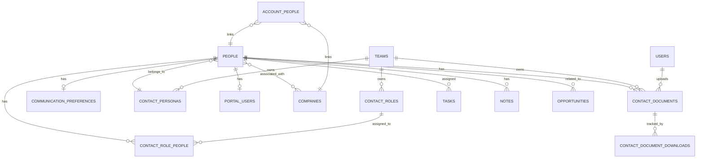

# Contacts Module Design Document

## Overview

The Contacts Module extends the existing People model to provide comprehensive contact management capabilities including role assignments, communication preferences, interaction tracking, portal access, duplicate detection, document attachment, and vCard import/export. The design leverages Laravel's Eloquent ORM, Filament for UI components, and follows the existing architectural patterns established in the Relaticle CRM application.

The module integrates seamlessly with existing Account (Company), Opportunity, Task, and Note modules while adding new capabilities for contact segmentation, self-service portal access, document management, and advanced data quality management.

## Architecture

### High-Level Architecture


### Module Structure

```
app/
├── Models/
│   ├── People.php (enhanced)
│   ├── ContactRole.php
│   ├── CommunicationPreference.php
│   ├── ContactPersona.php
│   ├── PortalUser.php
│   └── ContactDocument.php
├── Services/
│   ├── Contact/
│   │   ├── DuplicateDetectionService.php
│   │   ├── ContactMergeService.php
│   │   ├── VCardService.php
│   │   ├── PortalAccessService.php
│   │   └── ContactDocumentService.php
├── Actions/
│   ├── Contact/
│   │   ├── CreateContact.php
│   │   ├── UpdateContact.php
│   │   ├── MergeContacts.php
│   │   └── GrantPortalAccess.php
├── Filament/
│   ├── Resources/
│   │   └── PeopleResource.php (enhanced)
│   ├── Pages/
│   │   └── Portal/
│   │       └── ContactDashboard.php
├── Http/
│   ├── Controllers/
│   │   └── Portal/
│   │       └── ContactPortalController.php
│   └── Middleware/
│       └── AuthenticatePortalUser.php
├── Jobs/
│   ├── DetectDuplicateContacts.php
│   └── SendPortalCredentials.php
└── Observers/
    └── PeopleObserver.php (enhanced)
```

## Components and Interfaces

### 1. Enhanced People Model

The existing People model will be extended with new relationships and methods:

```php
class People extends Model
{
    // Existing traits and properties...
    
    // New relationships
    public function roles(): BelongsToMany;
    public function communicationPreferences(): HasOne;
    public function persona(): BelongsTo;
    public function portalUser(): HasOne;
    public function accounts(): BelongsToMany; // Multiple account associations
    public function documents(): HasMany;
    
    // New methods
    public function assignRole(string $role): void;
    public function hasRole(string $role): bool;
    public function canReceiveCommunication(string $channel): bool;
    public function grantPortalAccess(): PortalUser;
    public function revokePortalAccess(): void;
    public function getSimilarityScore(People $other): float;
    public function attachDocument(UploadedFile $file, array $metadata = []): ContactDocument;
    public function removeDocument(ContactDocument $document): void;
}
```

### 2. ContactRole Model

Manages role assignments for contacts:

```php
class ContactRole extends Model
{
    protected $fillable = ['name', 'description', 'team_id'];
    
    public function contacts(): BelongsToMany;
    public function team(): BelongsTo;
}
```

### 3. CommunicationPreference Model

Stores communication channel preferences:

```php
class CommunicationPreference extends Model
{
    protected $fillable = [
        'people_id',
        'email_opt_in',
        'phone_opt_in',
        'sms_opt_in',
        'postal_opt_in',
        'preferred_channel',
        'preferred_time',
        'do_not_contact'
    ];
    
    protected $casts = [
        'email_opt_in' => 'boolean',
        'phone_opt_in' => 'boolean',
        'sms_opt_in' => 'boolean',
        'postal_opt_in' => 'boolean',
        'do_not_contact' => 'boolean',
    ];
    
    public function contact(): BelongsTo;
    public function canContact(string $channel): bool;
}
```

### 4. ContactPersona Model

Defines personas for contact segmentation:

```php
class ContactPersona extends Model
{
    protected $fillable = ['name', 'description', 'team_id'];
    
    public function contacts(): HasMany;
    public function team(): BelongsTo;
    public function customFields(): HasMany;
}
```

### 5. PortalUser Model

Manages portal access credentials:

```php
class PortalUser extends Model implements Authenticatable
{
    use Authenticatable;
    
    protected $fillable = [
        'people_id',
        'email',
        'password',
        'is_active',
        'last_login_at'
    ];
    
    protected $hidden = ['password'];
    
    protected $casts = [
        'is_active' => 'boolean',
        'last_login_at' => 'datetime',
    ];
    
    public function contact(): BelongsTo;
    public function accessibleCases(): HasMany;
    public function logAccess(): void;
}
```

### 6. DuplicateDetectionService

Identifies potential duplicate contacts using fuzzy matching:

```php
class DuplicateDetectionService
{
    public function findDuplicates(People $contact): Collection;
    public function calculateSimilarity(People $contact1, People $contact2): float;
    private function normalizeString(string $value): string;
    private function levenshteinSimilarity(string $str1, string $str2): float;
    private function emailDomainMatch(string $email1, string $email2): bool;
}
```

**Algorithm Details:**
- Name matching: Levenshtein distance with normalization (case-insensitive, whitespace trimming)
- Email matching: Exact match on normalized email addresses
- Phone matching: Digit-only comparison after removing formatting
- Composite scoring: Weighted average (name: 40%, email: 40%, phone: 20%)
- Threshold: Similarity score >= 0.75 triggers duplicate alert

### 7. ContactMergeService

Handles merging of duplicate contact records:

```php
class ContactMergeService
{
    public function merge(People $primary, People $duplicate, array $fieldSelections): People;
    private function transferRelationships(People $from, People $to): void;
    private function transferCustomFields(People $from, People $to): void;
    private function archiveDuplicate(People $duplicate, People $primary): void;
    private function createMergeAuditLog(People $primary, People $duplicate): void;
}
```

**Merge Strategy:**
- User selects primary contact
- All relationships (tasks, notes, opportunities) transferred to primary
- Custom field values merged (primary takes precedence unless null)
- Duplicate contact soft-deleted with merge metadata
- Audit log created for compliance

### 8. VCardService

Handles vCard import and export:

```php
class VCardService
{
    public function import(UploadedFile $file): Collection;
    public function export(People $contact): string;
    public function exportMultiple(Collection $contacts): string;
    private function parseVCard(string $content): array;
    private function generateVCard(People $contact, string $version = '4.0'): string;
    private function validateVCard(string $content): bool;
}
```

**vCard Mapping:**
- FN → name
- EMAIL → custom field 'email'
- TEL → custom field 'phone'
- ORG → company relationship
- TITLE → custom field 'title'
- ADR → custom field 'address'
- NOTE → creates a note record

### 9. PortalAccessService

Manages portal user creation and authentication:

```php
class PortalAccessService
{
    public function grantAccess(People $contact, array $permissions = []): PortalUser;
    public function revokeAccess(People $contact): void;
    public function sendCredentials(PortalUser $portalUser): void;
    public function resetPassword(PortalUser $portalUser): string;
    private function generateSecurePassword(): string;
}
```

### 10. ContactDocument Model

Manages document attachments for contacts:

```php
class ContactDocument extends Model
{
    use SoftDeletes;
    
    protected $fillable = [
        'people_id',
        'filename',
        'original_filename',
        'file_path',
        'file_size',
        'mime_type',
        'uploaded_by',
        'team_id'
    ];
    
    protected $casts = [
        'file_size' => 'integer',
        'uploaded_at' => 'datetime',
        'deleted_at' => 'datetime',
    ];
    
    public function contact(): BelongsTo;
    public function uploader(): BelongsTo;
    public function team(): BelongsTo;
    public function getDownloadUrl(): string;
    public function logDownload(User $user): void;
}
```

### 11. ContactDocumentService

Handles document upload, storage, and retrieval:

```php
class ContactDocumentService
{
    public function upload(People $contact, UploadedFile $file, User $uploader): ContactDocument;
    public function download(ContactDocument $document, User $user): StreamedResponse;
    public function delete(ContactDocument $document, User $user): void;
    public function validateFileType(UploadedFile $file): bool;
    private function generateUniqueFilename(UploadedFile $file): string;
    private function storeFile(UploadedFile $file, string $filename): string;
    private function logActivity(ContactDocument $document, string $action, User $user): void;
}
```

**Supported File Types:**
- Documents: PDF, DOCX, XLSX, PPTX, TXT
- Images: JPG, JPEG, PNG, GIF, SVG
- Archives: ZIP (if needed for bulk documents)

**Storage Strategy:**
- Files stored using Laravel's Storage facade
- Path structure: `contacts/{team_id}/{people_id}/{filename}`
- Unique filenames generated using UUID to prevent collisions
- Original filename preserved in database for display
- Soft delete preserves files for recovery period
```

## Data Models

### Database Schema

#### Enhanced people table
```sql
ALTER TABLE people ADD COLUMN email VARCHAR(255);
ALTER TABLE people ADD COLUMN phone VARCHAR(50);
ALTER TABLE people ADD COLUMN mobile VARCHAR(50);
ALTER TABLE people ADD COLUMN title VARCHAR(255);
ALTER TABLE people ADD COLUMN department VARCHAR(255);
ALTER TABLE people ADD COLUMN address TEXT;
ALTER TABLE people ADD COLUMN persona_id BIGINT UNSIGNED;
ALTER TABLE people ADD COLUMN primary_account_id BIGINT UNSIGNED;
```

#### contact_roles table
```sql
CREATE TABLE contact_roles (
    id BIGINT UNSIGNED PRIMARY KEY AUTO_INCREMENT,
    name VARCHAR(255) NOT NULL,
    description TEXT,
    team_id BIGINT UNSIGNED NOT NULL,
    created_at TIMESTAMP,
    updated_at TIMESTAMP,
    FOREIGN KEY (team_id) REFERENCES teams(id) ON DELETE CASCADE
);
```

#### contact_role_people pivot table
```sql
CREATE TABLE contact_role_people (
    id BIGINT UNSIGNED PRIMARY KEY AUTO_INCREMENT,
    people_id BIGINT UNSIGNED NOT NULL,
    contact_role_id BIGINT UNSIGNED NOT NULL,
    created_at TIMESTAMP,
    FOREIGN KEY (people_id) REFERENCES people(id) ON DELETE CASCADE,
    FOREIGN KEY (contact_role_id) REFERENCES contact_roles(id) ON DELETE CASCADE
);
```

#### communication_preferences table
```sql
CREATE TABLE communication_preferences (
    id BIGINT UNSIGNED PRIMARY KEY AUTO_INCREMENT,
    people_id BIGINT UNSIGNED NOT NULL UNIQUE,
    email_opt_in BOOLEAN DEFAULT TRUE,
    phone_opt_in BOOLEAN DEFAULT TRUE,
    sms_opt_in BOOLEAN DEFAULT TRUE,
    postal_opt_in BOOLEAN DEFAULT TRUE,
    preferred_channel VARCHAR(50),
    preferred_time VARCHAR(50),
    do_not_contact BOOLEAN DEFAULT FALSE,
    created_at TIMESTAMP,
    updated_at TIMESTAMP,
    FOREIGN KEY (people_id) REFERENCES people(id) ON DELETE CASCADE
);
```

#### contact_personas table
```sql
CREATE TABLE contact_personas (
    id BIGINT UNSIGNED PRIMARY KEY AUTO_INCREMENT,
    name VARCHAR(255) NOT NULL,
    description TEXT,
    team_id BIGINT UNSIGNED NOT NULL,
    created_at TIMESTAMP,
    updated_at TIMESTAMP,
    FOREIGN KEY (team_id) REFERENCES teams(id) ON DELETE CASCADE
);
```

#### portal_users table
```sql
CREATE TABLE portal_users (
    id BIGINT UNSIGNED PRIMARY KEY AUTO_INCREMENT,
    people_id BIGINT UNSIGNED NOT NULL UNIQUE,
    email VARCHAR(255) NOT NULL UNIQUE,
    password VARCHAR(255) NOT NULL,
    is_active BOOLEAN DEFAULT TRUE,
    last_login_at TIMESTAMP NULL,
    remember_token VARCHAR(100),
    created_at TIMESTAMP,
    updated_at TIMESTAMP,
    FOREIGN KEY (people_id) REFERENCES people(id) ON DELETE CASCADE
);
```

#### account_people pivot table (for multiple account associations)
```sql
CREATE TABLE account_people (
    id BIGINT UNSIGNED PRIMARY KEY AUTO_INCREMENT,
    people_id BIGINT UNSIGNED NOT NULL,
    company_id BIGINT UNSIGNED NOT NULL,
    is_primary BOOLEAN DEFAULT FALSE,
    created_at TIMESTAMP,
    FOREIGN KEY (people_id) REFERENCES people(id) ON DELETE CASCADE,
    FOREIGN KEY (company_id) REFERENCES companies(id) ON DELETE CASCADE
);
```

#### contact_merge_log table
```sql
CREATE TABLE contact_merge_log (
    id BIGINT UNSIGNED PRIMARY KEY AUTO_INCREMENT,
    primary_contact_id BIGINT UNSIGNED NOT NULL,
    duplicate_contact_id BIGINT UNSIGNED NOT NULL,
    merged_by BIGINT UNSIGNED NOT NULL,
    merge_data JSON,
    created_at TIMESTAMP,
    FOREIGN KEY (primary_contact_id) REFERENCES people(id),
    FOREIGN KEY (merged_by) REFERENCES users(id)
);
```

#### contact_documents table
```sql
CREATE TABLE contact_documents (
    id BIGINT UNSIGNED PRIMARY KEY AUTO_INCREMENT,
    people_id BIGINT UNSIGNED NOT NULL,
    filename VARCHAR(255) NOT NULL,
    original_filename VARCHAR(255) NOT NULL,
    file_path VARCHAR(500) NOT NULL,
    file_size BIGINT UNSIGNED NOT NULL,
    mime_type VARCHAR(100) NOT NULL,
    uploaded_by BIGINT UNSIGNED NOT NULL,
    team_id BIGINT UNSIGNED NOT NULL,
    created_at TIMESTAMP,
    updated_at TIMESTAMP,
    deleted_at TIMESTAMP NULL,
    FOREIGN KEY (people_id) REFERENCES people(id) ON DELETE CASCADE,
    FOREIGN KEY (uploaded_by) REFERENCES users(id),
    FOREIGN KEY (team_id) REFERENCES teams(id) ON DELETE CASCADE,
    INDEX idx_people_documents (people_id, deleted_at),
    INDEX idx_team_documents (team_id, deleted_at)
);
```

#### contact_document_downloads table
```sql
CREATE TABLE contact_document_downloads (
    id BIGINT UNSIGNED PRIMARY KEY AUTO_INCREMENT,
    contact_document_id BIGINT UNSIGNED NOT NULL,
    downloaded_by BIGINT UNSIGNED NOT NULL,
    downloaded_at TIMESTAMP NOT NULL,
    ip_address VARCHAR(45),
    FOREIGN KEY (contact_document_id) REFERENCES contact_documents(id) ON DELETE CASCADE,
    FOREIGN KEY (downloaded_by) REFERENCES users(id),
    INDEX idx_document_downloads (contact_document_id, downloaded_at)
);
```

### Entity Relationships




## Correctness Properties

*A property is a characteristic or behavior that should hold true across all valid executions of a system—essentially, a formal statement about what the system should do. Properties serve as the bridge between human-readable specifications and machine-verifiable correctness guarantees.*

### Property 1: Contact persistence with valid data
*For any* contact with valid required fields (name, company), creating the contact should result in a persisted database record that can be retrieved with matching data.
**Validates: Requirements 1.1**

### Property 2: Contact update preservation
*For any* existing contact and any valid field updates, updating the contact should result in the new values being persisted and an audit trail entry being created.
**Validates: Requirements 1.2**

### Property 3: Contact soft delete preserves relationships
*For any* contact with associated tasks, notes, or opportunities, deleting the contact should archive it (soft delete) while maintaining all relationship references intact.
**Validates: Requirements 1.4**

### Property 4: Role assignment creates association
*For any* contact and any valid role, assigning the role should create a verifiable association between the contact and role that persists in the database.
**Validates: Requirements 2.1**

### Property 5: Multiple role assignment
*For any* contact and any set of roles, assigning multiple roles should result in all roles being associated with the contact.
**Validates: Requirements 2.5**

### Property 6: Role filtering returns only matching contacts
*For any* role and any set of contacts with various role assignments, filtering by that role should return only contacts that have been assigned that specific role.
**Validates: Requirements 2.4**

### Property 7: Communication preference storage and retrieval
*For any* contact and any valid communication preferences, setting the preferences should result in those exact preferences being retrievable for that contact.
**Validates: Requirements 3.1**

### Property 8: Opt-out prevents communication
*For any* contact with a channel opt-out set to false, attempting to send communication through that channel should be blocked by the system.
**Validates: Requirements 3.5**

### Property 9: Interaction history chronological ordering
*For any* contact with multiple notes created at different times, retrieving the interaction history should return notes sorted by creation date with most recent first.
**Validates: Requirements 4.1, 4.5**

### Property 10: Note and task linking
*For any* contact and any newly created note or task, creating the note/task for that contact should result in the note/task appearing in the contact's interaction history.
**Validates: Requirements 4.4**

### Property 11: Persona assignment and retrieval
*For any* contact and any persona, assigning the persona should result in that persona being associated with and retrievable for that contact.
**Validates: Requirements 5.1**

### Property 12: Persona filtering returns only matching contacts
*For any* persona and any set of contacts with various persona assignments, filtering by that persona should return only contacts assigned that specific persona.
**Validates: Requirements 5.3**

### Property 13: Portal access creation
*For any* contact without portal access, granting portal access should create a portal user record with valid credentials and send credentials to the contact.
**Validates: Requirements 6.1**

### Property 14: Portal authentication with valid credentials
*For any* portal user with valid credentials, attempting to authenticate should succeed and grant access to the portal dashboard.
**Validates: Requirements 6.2**

### Property 15: Portal authorization restricts data access
*For any* portal user and any data they are not authorized to access, attempting to view that data should be denied by the system.
**Validates: Requirements 6.3**

### Property 16: Portal activity logging
*For any* portal user action, the system should create an audit log entry recording the action, user, and timestamp.
**Validates: Requirements 6.5**

### Property 17: Duplicate detection on creation
*For any* new contact with an email or name similar to an existing contact (similarity >= 0.75), the system should detect and flag the potential duplicate.
**Validates: Requirements 7.1**

### Property 18: Fuzzy name matching detects variations
*For any* two contacts with name variations (e.g., "John Smith" vs "Jon Smith"), the duplicate detection algorithm should calculate a similarity score reflecting their likeness.
**Validates: Requirements 7.4, 7.5**

### Property 19: Contact merge transfers all relationships
*For any* two contacts being merged where the duplicate has tasks, notes, or opportunities, all relationships should be transferred to the primary contact.
**Validates: Requirements 8.2**

### Property 20: Contact merge preserves unique data
*For any* two contacts being merged with different non-null field values, the merged contact should contain all unique data from both records.
**Validates: Requirements 8.4**

### Property 21: Merge operation rollback on failure
*For any* merge operation that encounters an error, the system should rollback all changes leaving both contacts in their original state.
**Validates: Requirements 8.5**

### Property 22: vCard round-trip preservation
*For any* contact, exporting to vCard and then importing that vCard should result in a contact with equivalent standard field values.
**Validates: Requirements 9.1, 9.2**

### Property 23: vCard validation rejects invalid format
*For any* file that does not conform to vCard 3.0 or 4.0 format specifications, the import process should reject the file and report format errors.
**Validates: Requirements 9.3**

### Property 24: Multi-contact vCard export completeness
*For any* set of selected contacts, exporting to vCard should produce a file containing vCard entries for all selected contacts.
**Validates: Requirements 9.4**

### Property 25: Custom field availability after creation
*For any* newly created custom field, the field should immediately be available for data entry on all contact forms.
**Validates: Requirements 10.1**

### Property 26: Custom field type validation
*For any* custom field with a specific type (number, date, etc.) and any input value, the system should validate the value matches the field type before accepting it.
**Validates: Requirements 10.2**

### Property 27: Search returns matching contacts
*For any* search query and any set of contacts, the search should return all contacts where the query matches name, email, phone, company, or custom field values.
**Validates: Requirements 11.1**

### Property 28: Filter application returns only matching contacts
*For any* filter criteria and any set of contacts, applying the filter should return only contacts that match all specified criteria.
**Validates: Requirements 11.2**

### Property 29: Sort order correctness
*For any* field and sort direction (ascending/descending), sorting contacts should order them correctly by that field in the specified direction.
**Validates: Requirements 11.4**

### Property 30: Export contains all selected contacts
*For any* set of selected contacts, initiating an export should generate a file containing records for all and only the selected contacts.
**Validates: Requirements 12.1, 12.4**

### Property 31: Export includes custom field data
*For any* contact with custom field values, exporting that contact should include both standard and custom field data in the export file.
**Validates: Requirements 12.3**

### Property 32: Filtered export respects criteria
*For any* active filter criteria, exporting all contacts should include only contacts matching the current filter criteria.
**Validates: Requirements 12.5**

### Property 33: Multi-account association creation
*For any* contact and any account, creating an association should result in a verifiable relationship between the contact and account.
**Validates: Requirements 13.1**

### Property 34: Account association removal preserves entities
*For any* contact-account association, removing the association should delete the relationship while leaving both the contact and account records intact.
**Validates: Requirements 13.3**

### Property 35: Primary account designation
*For any* contact associated with multiple accounts, designating one as primary should mark that account as primary while others remain non-primary.
**Validates: Requirements 13.5**

### Property 36: Document upload with metadata
*For any* contact and any valid file upload, uploading the document should result in a persisted document record with all required metadata (filename, size, upload date, uploader) correctly stored.
**Validates: Requirements 14.1**

### Property 37: Document display completeness
*For any* contact with attached documents, viewing the contact should display all attached documents with their file details in a dedicated section.
**Validates: Requirements 14.2**

### Property 38: File type validation
*For any* file of a supported type (PDF, DOCX, XLSX, PPTX, images), the system should accept the upload, and for any unsupported file type, the system should reject the upload.
**Validates: Requirements 14.3**

### Property 39: Document download with logging
*For any* attached document, downloading the document should serve the correct file and create a download activity log entry with user and timestamp.
**Validates: Requirements 14.4**

### Property 40: Document soft delete with permissions
*For any* document and any user, attempting to delete the document should check permissions and, if authorized, move the document to a soft-deleted state rather than permanently removing it.
**Validates: Requirements 14.5**

## Error Handling

### Validation Errors
- **Invalid Contact Data**: Return validation errors with specific field messages
- **Duplicate Email**: Prevent creation if email already exists within team
- **Missing Required Fields**: Block creation/update with clear error messages
- **Invalid Custom Field Type**: Reject data that doesn't match field type constraints

### Duplicate Detection Errors
- **Similarity Calculation Failure**: Log error and continue without blocking operation
- **Database Query Timeout**: Return partial results with warning
- **Invalid Comparison Data**: Skip comparison and log warning

### Merge Operation Errors
- **Relationship Transfer Failure**: Rollback entire transaction
- **Data Conflict**: Present conflict resolution UI to user
- **Permission Denied**: Block merge and show authorization error
- **Database Constraint Violation**: Rollback and show user-friendly error

### vCard Import/Export Errors
- **Invalid vCard Format**: Report specific format errors to user
- **Unsupported vCard Version**: Reject with version requirement message
- **File Size Exceeded**: Reject with size limit message
- **Encoding Issues**: Attempt UTF-8 conversion, fail gracefully if impossible
- **Missing Required vCard Fields**: Skip record and log warning

### Portal Access Errors
- **Invalid Credentials**: Return authentication failure message
- **Account Disabled**: Block access with account status message
- **Permission Denied**: Show authorization error for restricted resources
- **Session Expired**: Redirect to login with session timeout message

### Document Management Errors
- **Unsupported File Type**: Reject upload with list of supported formats
- **File Size Exceeded**: Reject with maximum file size message
- **Storage Failure**: Log error and show user-friendly message
- **Permission Denied**: Block upload/download/delete with authorization error
- **File Not Found**: Handle missing files gracefully with error message
- **Virus Detection**: Reject file and notify administrators (if virus scanning enabled)

### General Error Handling Strategy
- All errors logged with context (user, action, timestamp, stack trace)
- User-facing errors are friendly and actionable
- System errors trigger notifications to administrators
- Database transactions used for multi-step operations
- Graceful degradation when non-critical features fail

## Testing Strategy

### Unit Testing

Unit tests will verify specific functionality of individual components:

**Model Tests:**
- Contact CRUD operations
- Relationship methods (roles, accounts, preferences)
- Soft delete behavior
- Custom field integration

**Service Tests:**
- Duplicate detection algorithm accuracy
- Similarity score calculation
- vCard parsing and generation
- Merge operation logic
- Portal access management

**Action Tests:**
- Contact creation with validation
- Contact update with audit trail
- Role assignment
- Portal credential generation

**Example Unit Tests:**
```php
test('contact can be created with valid data')
test('contact requires name and company')
test('duplicate detection finds similar emails')
test('vCard export includes all standard fields')
test('merge transfers all relationships')
test('portal user can authenticate with valid credentials')
test('communication preference blocks opted-out channels')
test('document can be attached to contact')
test('document upload stores correct metadata')
test('unsupported file types are rejected')
test('document download is logged')
test('document deletion requires permissions')
```

### Property-Based Testing

Property-based tests will verify universal properties across many randomly generated inputs using **Pest PHP with Pest Property Plugin** (https://github.com/pestphp/pest-plugin-property).

**Configuration:**
- Minimum 100 iterations per property test
- Use Pest's `property()` function for test definition
- Custom generators for domain objects (contacts, roles, preferences)

**Test Organization:**
- Property tests co-located with feature code in `tests/Feature/Contact/`
- Each property test tagged with design document reference
- Generators defined in `tests/Support/Generators/`

**Key Property Tests:**

1. **Contact Persistence Property** (Property 1)
   - Generate random valid contacts
   - Create each contact
   - Verify persisted data matches input

2. **Role Assignment Property** (Property 4, 5)
   - Generate random contacts and role sets
   - Assign roles to contacts
   - Verify all associations exist

3. **Duplicate Detection Property** (Property 17, 18)
   - Generate contact pairs with varying similarity
   - Run duplicate detection
   - Verify similarity scores are consistent and accurate

4. **Merge Preservation Property** (Property 19, 20)
   - Generate contact pairs with relationships and unique data
   - Perform merge
   - Verify all relationships transferred and unique data preserved

5. **vCard Round-Trip Property** (Property 22)
   - Generate random contacts
   - Export to vCard then import
   - Verify resulting contact matches original

6. **Search Matching Property** (Property 27)
   - Generate contacts with various field values
   - Search for terms present in contacts
   - Verify all matching contacts returned

7. **Filter Correctness Property** (Property 28)
   - Generate contacts with various attributes
   - Apply filters
   - Verify only matching contacts returned

8. **Sort Order Property** (Property 29)
   - Generate contacts with various field values
   - Sort by field
   - Verify order is correct

9. **Document Upload Property** (Property 36)
   - Generate random contacts and valid file uploads
   - Upload documents to contacts
   - Verify all metadata is correctly stored

10. **File Type Validation Property** (Property 38)
   - Generate files of various types (supported and unsupported)
   - Attempt uploads
   - Verify supported types accepted and unsupported rejected

11. **Document Download Logging Property** (Property 39)
   - Generate random documents attached to contacts
   - Download documents
   - Verify download logs are created with correct data

12. **Document Soft Delete Property** (Property 40)
   - Generate random documents
   - Delete with various permission levels
   - Verify permission checks and soft-delete behavior

**Example Property Test Structure:**
```php
use function Pest\Property\property;

property('contact merge preserves all relationships', function () {
    // Feature: contacts-module, Property 19: Contact merge transfers all relationships
    
    $primary = generateRandomContact();
    $duplicate = generateRandomContact();
    $tasks = generateRandomTasks($duplicate);
    $notes = generateRandomNotes($duplicate);
    
    $merged = ContactMergeService::merge($primary, $duplicate);
    
    expect($merged->tasks)->toHaveCount(count($tasks))
        ->and($merged->notes)->toHaveCount(count($notes));
})->iterations(100);
```

### Integration Testing

Integration tests will verify interactions between modules:

- Contact creation triggers duplicate detection
- Contact updates invalidate AI summaries
- Portal access integrates with authentication system
- Export functionality works with custom fields module
- Multi-account associations work with Company module

### Test Data Generators

Custom generators for property-based testing:

```php
function generateRandomContact(): array
function generateRandomRole(): string
function generateRandomPersona(): ContactPersona
function generateRandomCommunicationPreferences(): array
function generateRandomVCard(string $version = '4.0'): string
function generateSimilarContact(People $contact, float $similarity): array
function generateRandomDocument(string $type = 'pdf'): UploadedFile
function generateRandomFileType(): string
function generateUnsupportedFileType(): string
```

### Testing Best Practices

- Write tests before implementation (TDD approach)
- Property tests focus on invariants and universal rules
- Unit tests cover specific examples and edge cases
- Mock external dependencies (email sending, file storage)
- Use database transactions for test isolation
- Test both success and failure paths
- Verify error messages are user-friendly

## Implementation Phases

### Phase 1: Core Contact Enhancements
- Extend People model with new fields
- Add email, phone, mobile, title, department, address fields
- Update PeopleResource forms and tables
- Implement basic validation

### Phase 2: Role Management
- Create ContactRole model and migrations
- Implement role assignment functionality
- Add role filtering to contact lists
- Update UI to display roles

### Phase 3: Communication Preferences
- Create CommunicationPreference model
- Implement preference management UI
- Add opt-out enforcement logic
- Integrate with communication systems

### Phase 4: Personas
- Create ContactPersona model
- Implement persona assignment
- Add persona-based filtering
- Link personas to custom fields

### Phase 5: Duplicate Detection
- Implement DuplicateDetectionService
- Add fuzzy matching algorithms
- Create duplicate detection UI
- Add similarity scoring

### Phase 6: Contact Merging
- Implement ContactMergeService
- Create merge UI with field comparison
- Add relationship transfer logic
- Implement merge audit logging

### Phase 7: vCard Support
- Implement VCardService
- Add vCard import functionality
- Add vCard export functionality
- Support both v3.0 and v4.0 formats

### Phase 8: Portal Access
- Create PortalUser model and authentication
- Implement portal dashboard
- Add authorization logic
- Create portal access management UI

### Phase 9: Multi-Account Associations
- Create account_people pivot table
- Implement multiple account associations
- Add primary account designation
- Update UI to show all associated accounts

### Phase 10: Document Management
- Create ContactDocument model and migrations
- Implement ContactDocumentService
- Add document upload functionality to contact forms
- Create document display section in contact view
- Implement download with activity logging
- Add soft delete with permission checks
- Integrate with existing file storage system

### Phase 11: Search and Export Enhancements
- Enhance search to include new fields
- Add role and persona filters
- Update export to include new data
- Add vCard export option

## Security Considerations

### Authentication and Authorization
- Portal users have separate authentication from team users
- Role-based access control for contact management
- Team-scoped data isolation (existing HasTeam trait)
- Portal users can only access their own data

### Data Privacy
- Communication preferences respected in all outreach
- Opt-out flags enforced at system level
- Portal access requires explicit grant
- Audit logging for compliance (GDPR, CCPA)

### Input Validation
- All user inputs sanitized and validated
- Email format validation
- Phone number format validation
- vCard content validation to prevent injection attacks

### Password Security
- Portal passwords hashed using bcrypt
- Secure password generation for initial credentials
- Password reset functionality with token expiration
- Account lockout after failed login attempts

### Document Security
- File uploads validated for type and size
- Files stored outside public web root
- Access controlled through authorization policies
- Download activity logged for audit trail
- Soft delete preserves files for recovery
- Team-scoped access prevents cross-tenant data leaks
- Optional virus scanning integration for uploaded files

## Performance Considerations

### Database Optimization
- Indexes on frequently queried fields (email, phone, name)
- Composite indexes for multi-field searches
- Eager loading for relationships to avoid N+1 queries
- Database query caching for duplicate detection

### Duplicate Detection Performance
- Limit similarity checks to contacts within same team
- Use database indexes for initial filtering
- Implement batch processing for large datasets
- Cache similarity scores for frequently compared contacts

### vCard Processing
- Stream large vCard files instead of loading into memory
- Process imports in background jobs for large files
- Implement progress tracking for long-running imports
- Set reasonable file size limits

### Portal Performance
- Cache portal user permissions
- Implement session management
- Use database indexes for portal queries
- Limit data returned to portal users

### Document Management Performance
- Stream large file downloads instead of loading into memory
- Implement file size limits (e.g., 10MB per file)
- Use database indexes on people_id and team_id for document queries
- Lazy load document lists in contact views
- Consider CDN integration for frequently accessed documents
- Implement pagination for contacts with many documents
- Background job processing for virus scanning (if enabled)

## Dependencies

### External Libraries
- **Pest Property Plugin**: Property-based testing framework
- **Laravel Sanctum**: Portal authentication (already installed)
- **Spatie Laravel Data**: Data transfer objects (already installed)
- **sabre/vobject**: vCard parsing and generation (to be added)

### Internal Dependencies
- **Custom Fields Module**: Already integrated via UsesCustomFields trait
- **Company Module**: Existing relationship via company_id
- **Task Module**: Existing morphToMany relationship
- **Note Module**: Existing HasNotes trait
- **Opportunity Module**: For interaction history

### New Package Requirements
```json
{
    "require": {
        "sabre/vobject": "^4.5"
    },
    "require-dev": {
        "pestphp/pest-plugin-property": "^1.0"
    }
}
```

## Migration Strategy

### Database Migrations
1. Add new columns to people table
2. Create new tables (contact_roles, communication_preferences, etc.)
3. Create pivot tables (contact_role_people, account_people)
4. Add indexes for performance
5. Backfill communication preferences for existing contacts

### Data Migration
- Existing People records remain unchanged
- Default communication preferences created for existing contacts
- Existing company relationships preserved
- No breaking changes to existing functionality

### Backward Compatibility
- All new fields are nullable or have defaults
- Existing API endpoints continue to work
- New features are additive, not replacing
- Gradual rollout of new functionality

## Monitoring and Observability

### Metrics to Track
- Contact creation rate
- Duplicate detection accuracy
- Merge operation success rate
- vCard import/export volume
- Portal login frequency
- Search query performance
- Document upload volume and success rate
- Document download frequency
- Storage usage per team
- Average document size
- File type distribution

### Logging
- All contact operations logged with user context
- Duplicate detection results logged
- Merge operations logged with full audit trail
- Portal access logged for security
- vCard import errors logged with details
- Document uploads logged with file metadata
- Document downloads logged with user and timestamp
- Document deletions logged with user context
- File validation failures logged with reason
- Storage errors logged with full context

### Alerts
- Failed merge operations
- High duplicate detection rate (potential data quality issue)
- Portal authentication failures (potential security issue)
- vCard import failures
- Database query performance degradation
- Storage quota approaching limit
- High rate of file upload failures
- Suspicious download patterns (potential data exfiltration)
- Virus detection in uploaded files (if scanning enabled)
