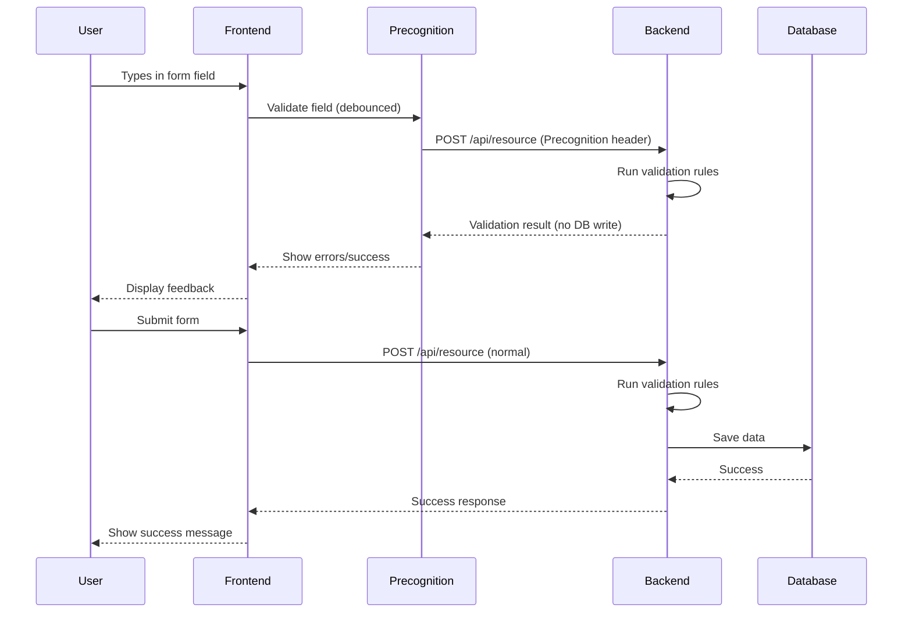

# Laravel Precognition Integration Guide

## Overview

Laravel Precognition provides real-time frontend validation by running backend validation rules before form submission. This creates a seamless user experience with instant feedback while maintaining server-side validation security.

**Key Benefits:**
- Real-time validation feedback as users type
- Reduces failed form submissions
- Maintains server-side validation rules as single source of truth
- Works seamlessly with Filament v4.3+ forms
- No duplicate validation logic between frontend and backend

## How It Works



## Installation & Setup

### 1. Middleware Configuration

Precognition is built into Laravel 12. Add the middleware to your API routes:

```php
// bootstrap/app.php
->withMiddleware(function (Middleware $middleware) {
    $middleware->api(prepend: [
        \Illuminate\Foundation\Http\Middleware\HandlePrecognitiveRequests::class,
    ]);
})
```

### 2. Frontend Package Installation

```bash
npm install laravel-precognition-vue
# or for React
npm install laravel-precognition-react
# or for Alpine
npm install laravel-precognition-alpine
```

### 3. Configure Vite

```js
// vite.config.js
import { defineConfig } from 'vite';
import laravel from 'laravel-vite-plugin';
import vue from '@vitejs/plugin-vue';

export default defineConfig({
    plugins: [
        laravel({
            input: ['resources/js/app.js', 'resources/css/app.css'],
            refresh: true,
        }),
        vue(),
    ],
    resolve: {
        alias: {
            '@': '/resources/js',
        },
    },
});
```

## Backend Implementation

### Form Request with Precognition

```php
<?php

namespace App\Http\Requests;

use Illuminate\Foundation\Http\FormRequest;
use Illuminate\Validation\Rule;

class StoreContactRequest extends FormRequest
{
    public function authorize(): bool
    {
        return true;
    }

    public function rules(): array
    {
        return [
            'name' => ['required', 'string', 'max:255'],
            'email' => [
                'required',
                'email',
                'max:255',
                Rule::unique('people', 'email')
                    ->where('team_id', auth()->user()->currentTeam->id)
                    ->ignore($this->route('contact')),
            ],
            'phone' => ['nullable', 'string', 'max:50'],
            'company_id' => ['required', 'exists:companies,id'],
            'title' => ['nullable', 'string', 'max:255'],
            'department' => ['nullable', 'string', 'max:255'],
            'persona_id' => ['nullable', 'exists:contact_personas,id'],
        ];
    }

    public function messages(): array
    {
        return [
            'name.required' => __('app.validation.contact_name_required'),
            'email.required' => __('app.validation.email_required'),
            'email.unique' => __('app.validation.email_already_exists'),
            'company_id.required' => __('app.validation.company_required'),
        ];
    }
}
```

### Controller with Precognition Support

```php
<?php

namespace App\Http\Controllers\Api;

use App\Http\Controllers\Controller;
use App\Http\Requests\StoreContactRequest;
use App\Http\Requests\UpdateContactRequest;
use App\Models\People;
use Illuminate\Http\JsonResponse;

class ContactController extends Controller
{
    /**
     * Store a new contact.
     * Supports precognitive validation.
     */
    public function store(StoreContactRequest $request): JsonResponse
    {
        // Precognitive requests stop here after validation
        // Only actual submissions reach this point
        
        $contact = People::create([
            'name' => $request->name,
            'email' => $request->email,
            'phone' => $request->phone,
            'company_id' => $request->company_id,
            'title' => $request->title,
            'department' => $request->department,
            'persona_id' => $request->persona_id,
            'team_id' => auth()->user()->currentTeam->id,
        ]);

        return response()->json([
            'message' => __('app.messages.contact_created'),
            'data' => $contact,
        ], 201);
    }

    /**
     * Update an existing contact.
     * Supports precognitive validation.
     */
    public function update(UpdateContactRequest $request, People $contact): JsonResponse
    {
        $contact->update($request->validated());

        return response()->json([
            'message' => __('app.messages.contact_updated'),
            'data' => $contact,
        ]);
    }
}
```

### API Routes

```php
// routes/api.php
use App\Http\Controllers\Api\ContactController;
use Illuminate\Support\Facades\Route;

Route::middleware(['auth:sanctum'])->group(function () {
    Route::apiResource('contacts', ContactController::class);
    Route::apiResource('companies', CompanyController::class);
    Route::apiResource('opportunities', OpportunityController::class);
});
```

## Frontend Implementation (Vue 3)

### Basic Form with Precognition

```vue
<script setup>
import { useForm } from 'laravel-precognition-vue';
import { ref } from 'vue';

const props = defineProps({
    companies: Array,
    personas: Array,
});

const form = useForm('post', '/api/contacts', {
    name: '',
    email: '',
    phone: '',
    company_id: null,
    title: '',
    department: '',
    persona_id: null,
});

const submit = () => {
    form.submit({
        preserveScroll: true,
        onSuccess: () => {
            // Handle success
            form.reset();
        },
    });
};
</script>

<template>
    <form @submit.prevent="submit">
        <div class="space-y-4">
            <!-- Name Field -->
            <div>
                <label for="name" class="block text-sm font-medium">
                    {{ __('app.labels.name') }} *
                </label>
                <input
                    id="name"
                    v-model="form.name"
                    type="text"
                    class="mt-1 block w-full rounded-md border-gray-300"
                    @change="form.validate('name')"
                />
                <p v-if="form.invalid('name')" class="mt-1 text-sm text-red-600">
                    {{ form.errors.name }}
                </p>
            </div>

            <!-- Email Field -->
            <div>
                <label for="email" class="block text-sm font-medium">
                    {{ __('app.labels.email') }} *
                </label>
                <input
                    id="email"
                    v-model="form.email"
                    type="email"
                    class="mt-1 block w-full rounded-md border-gray-300"
                    @change="form.validate('email')"
                />
                <p v-if="form.invalid('email')" class="mt-1 text-sm text-red-600">
                    {{ form.errors.email }}
                </p>
                <p v-else-if="form.valid('email')" class="mt-1 text-sm text-green-600">
                    ✓ Email is available
                </p>
            </div>

            <!-- Phone Field -->
            <div>
                <label for="phone" class="block text-sm font-medium">
                    {{ __('app.labels.phone') }}
                </label>
                <input
                    id="phone"
                    v-model="form.phone"
                    type="tel"
                    class="mt-1 block w-full rounded-md border-gray-300"
                    @change="form.validate('phone')"
                />
                <p v-if="form.invalid('phone')" class="mt-1 text-sm text-red-600">
                    {{ form.errors.phone }}
                </p>
            </div>

            <!-- Company Select -->
            <div>
                <label for="company_id" class="block text-sm font-medium">
                    {{ __('app.labels.company') }} *
                </label>
                <select
                    id="company_id"
                    v-model="form.company_id"
                    class="mt-1 block w-full rounded-md border-gray-300"
                    @change="form.validate('company_id')"
                >
                    <option :value="null">{{ __('app.placeholders.select_company') }}</option>
                    <option v-for="company in companies" :key="company.id" :value="company.id">
                        {{ company.name }}
                    </option>
                </select>
                <p v-if="form.invalid('company_id')" class="mt-1 text-sm text-red-600">
                    {{ form.errors.company_id }}
                </p>
            </div>

            <!-- Submit Button -->
            <div class="flex justify-end">
                <button
                    type="submit"
                    :disabled="form.processing"
                    class="px-4 py-2 bg-blue-600 text-white rounded-md hover:bg-blue-700 disabled:opacity-50"
                >
                    <span v-if="form.processing">{{ __('app.actions.saving') }}...</span>
                    <span v-else>{{ __('app.actions.save') }}</span>
                </button>
            </div>
        </div>
    </form>
</template>
```

### Advanced: Debounced Validation

```vue
<script setup>
import { useForm } from 'laravel-precognition-vue';
import { watchDebounced } from '@vueuse/core';

const form = useForm('post', '/api/contacts', {
    name: '',
    email: '',
});

// Validate email after 500ms of no typing
watchDebounced(
    () => form.email,
    () => {
        if (form.email) {
            form.validate('email');
        }
    },
    { debounce: 500 }
);

// Validate name after 300ms
watchDebounced(
    () => form.name,
    () => {
        if (form.name) {
            form.validate('name');
        }
    },
    { debounce: 300 }
);
</script>
```

### Validation on Blur

```vue
<template>
    <input
        v-model="form.email"
        type="email"
        @blur="form.validate('email')"
    />
</template>
```

## Filament Integration

### Custom Livewire Component with Precognition

```php
<?php

namespace App\Filament\Pages;

use App\Models\People;
use Filament\Forms;
use Filament\Forms\Form;
use Filament\Pages\Page;
use Illuminate\Support\Facades\Validator;

class CreateContact extends Page implements Forms\Contracts\HasForms
{
    use Forms\Concerns\InteractsWithForms;

    protected static string $view = 'filament.pages.create-contact';

    public ?array $data = [];

    public function mount(): void
    {
        $this->form->fill();
    }

    public function form(Form $form): Form
    {
        return $form
            ->schema([
                Forms\Components\TextInput::make('name')
                    ->label(__('app.labels.name'))
                    ->required()
                    ->maxLength(255)
                    ->precognitive(),

                Forms\Components\TextInput::make('email')
                    ->label(__('app.labels.email'))
                    ->email()
                    ->required()
                    ->maxLength(255)
                    ->unique(People::class, 'email', ignoreRecord: true)
                    ->precognitive(debounce: 500),

                Forms\Components\Select::make('company_id')
                    ->label(__('app.labels.company'))
                    ->relationship('company', 'name')
                    ->required()
                    ->searchable()
                    ->preload(),

                Forms\Components\TextInput::make('phone')
                    ->label(__('app.labels.phone'))
                    ->tel()
                    ->maxLength(50),

                Forms\Components\TextInput::make('title')
                    ->label(__('app.labels.title'))
                    ->maxLength(255),
            ])
            ->statePath('data');
    }

    public function create(): void
    {
        $data = $this->form->getState();

        People::create($data);

        $this->redirect(PeopleResource::getUrl('index'));
    }
}
```

### Filament Action with Precognition

```php
use Filament\Actions\Action;
use Filament\Forms;

Action::make('createContact')
    ->form([
        Forms\Components\TextInput::make('name')
            ->required()
            ->live(onBlur: true)
            ->afterStateUpdated(fn ($state, $livewire) => 
                $livewire->validateOnly('data.name')
            ),
        
        Forms\Components\TextInput::make('email')
            ->email()
            ->required()
            ->unique(People::class, 'email')
            ->live(debounce: 500)
            ->afterStateUpdated(fn ($state, $livewire) => 
                $livewire->validateOnly('data.email')
            ),
    ])
    ->action(function (array $data) {
        People::create($data);
    });
```

## Testing Precognition

### Feature Test

```php
<?php

use App\Models\People;
use App\Models\User;
use function Pest\Laravel\actingAs;
use function Pest\Laravel\postJson;

it('validates contact data precognitively', function () {
    $user = User::factory()->create();
    
    actingAs($user)
        ->postJson('/api/contacts', [
            'name' => 'John Doe',
            'email' => 'invalid-email',
        ], [
            'Precognition' => 'true',
            'Precognition-Validate-Only' => 'email',
        ])
        ->assertStatus(422)
        ->assertJsonValidationErrors(['email']);
});

it('allows valid email during precognitive validation', function () {
    $user = User::factory()->create();
    
    actingAs($user)
        ->postJson('/api/contacts', [
            'name' => 'John Doe',
            'email' => 'john@example.com',
            'company_id' => 1,
        ], [
            'Precognition' => 'true',
            'Precognition-Validate-Only' => 'email',
        ])
        ->assertStatus(204); // No content = validation passed
});

it('detects duplicate email during precognitive validation', function () {
    $user = User::factory()->create();
    $existing = People::factory()->create(['email' => 'existing@example.com']);
    
    actingAs($user)
        ->postJson('/api/contacts', [
            'name' => 'Jane Doe',
            'email' => 'existing@example.com',
        ], [
            'Precognition' => 'true',
            'Precognition-Validate-Only' => 'email',
        ])
        ->assertStatus(422)
        ->assertJsonValidationErrors(['email']);
});

it('does not save data during precognitive validation', function () {
    $user = User::factory()->create();
    $initialCount = People::count();
    
    actingAs($user)
        ->postJson('/api/contacts', [
            'name' => 'John Doe',
            'email' => 'john@example.com',
            'company_id' => 1,
        ], [
            'Precognition' => 'true',
        ])
        ->assertStatus(204);
    
    expect(People::count())->toBe($initialCount);
});

it('saves data during actual submission', function () {
    $user = User::factory()->create();
    
    actingAs($user)
        ->postJson('/api/contacts', [
            'name' => 'John Doe',
            'email' => 'john@example.com',
            'company_id' => 1,
        ])
        ->assertStatus(201);
    
    expect(People::where('email', 'john@example.com')->exists())->toBeTrue();
});
```

## Best Practices

### 1. Debounce Validation

Always debounce validation to avoid excessive API calls:

```vue
<input
    v-model="form.email"
    @input="debounce(() => form.validate('email'), 500)"
/>
```

### 2. Validate on Blur for Text Fields

For better UX, validate text fields when user leaves the field:

```vue
<input
    v-model="form.name"
    @blur="form.validate('name')"
/>
```

### 3. Immediate Validation for Selects

Validate select fields immediately on change:

```vue
<select
    v-model="form.company_id"
    @change="form.validate('company_id')"
>
```

### 4. Show Success Indicators

Provide positive feedback for valid fields:

```vue
<p v-if="form.valid('email')" class="text-green-600">
    ✓ Email is available
</p>
```

### 5. Handle Network Errors

```vue
<script setup>
const form = useForm('post', '/api/contacts', {
    // ...
});

form.submit({
    onError: (errors) => {
        console.error('Validation errors:', errors);
    },
    onFinish: () => {
        // Always runs
    },
});
</script>
```

### 6. Disable Submit During Processing

```vue
<button
    type="submit"
    :disabled="form.processing || form.hasErrors"
>
    Submit
</button>
```

## Performance Considerations

### 1. Selective Validation

Only validate fields that have changed:

```js
form.validate('email'); // Validate single field
form.validate(['email', 'name']); // Validate multiple fields
```

### 2. Conditional Validation

Skip validation for unchanged fields:

```vue
<script setup>
const originalEmail = ref('');

watchDebounced(
    () => form.email,
    (newEmail) => {
        if (newEmail !== originalEmail.value) {
            form.validate('email');
        }
    },
    { debounce: 500 }
);
</script>
```

### 3. Cancel Pending Requests

```js
// Automatically handled by laravel-precognition
// Previous validation requests are cancelled when new ones are made
```

## Common Patterns

### Pattern 1: Multi-Step Form

```vue
<script setup>
import { useForm } from 'laravel-precognition-vue';
import { ref } from 'vue';

const step = ref(1);
const form = useForm('post', '/api/contacts', {
    // Step 1
    name: '',
    email: '',
    // Step 2
    company_id: null,
    title: '',
    // Step 3
    phone: '',
    address: '',
});

const nextStep = async () => {
    const fieldsToValidate = {
        1: ['name', 'email'],
        2: ['company_id', 'title'],
    }[step.value];

    await form.validate(fieldsToValidate);

    if (!form.hasErrors) {
        step.value++;
    }
};

const previousStep = () => {
    step.value--;
};

const submit = () => {
    form.submit({
        onSuccess: () => {
            // Handle success
        },
    });
};
</script>
```

### Pattern 2: Conditional Fields

```vue
<script setup>
const form = useForm('post', '/api/contacts', {
    type: 'individual',
    person_name: '',
    company_name: '',
});

watch(() => form.type, (newType) => {
    // Clear and validate based on type
    if (newType === 'individual') {
        form.company_name = '';
        form.validate('person_name');
    } else {
        form.person_name = '';
        form.validate('company_name');
    }
});
</script>

<template>
    <select v-model="form.type" @change="form.validate('type')">
        <option value="individual">Individual</option>
        <option value="company">Company</option>
    </select>

    <input
        v-if="form.type === 'individual'"
        v-model="form.person_name"
        @blur="form.validate('person_name')"
    />

    <input
        v-if="form.type === 'company'"
        v-model="form.company_name"
        @blur="form.validate('company_name')"
    />
</template>
```

### Pattern 3: File Upload with Validation

```vue
<script setup>
const form = useForm('post', '/api/contacts', {
    name: '',
    avatar: null,
});

const handleFileChange = (event) => {
    form.avatar = event.target.files[0];
    form.validate('avatar');
};
</script>

<template>
    <input
        type="file"
        accept="image/*"
        @change="handleFileChange"
    />
    <p v-if="form.invalid('avatar')" class="text-red-600">
        {{ form.errors.avatar }}
    </p>
</template>
```

## Troubleshooting

### Issue: Validation Not Triggering

**Solution:** Ensure middleware is properly configured:

```php
// bootstrap/app.php
->withMiddleware(function (Middleware $middleware) {
    $middleware->api(prepend: [
        \Illuminate\Foundation\Http\Middleware\HandlePrecognitiveRequests::class,
    ]);
})
```

### Issue: CORS Errors

**Solution:** Configure CORS to allow Precognition headers:

```php
// config/cors.php
'allowed_headers' => ['*'],
'exposed_headers' => ['Precognition', 'Precognition-Success'],
```

### Issue: Validation Rules Not Applied

**Solution:** Ensure Form Request is type-hinted in controller:

```php
public function store(StoreContactRequest $request) // ✓ Correct
public function store(Request $request) // ✗ Wrong
```

### Issue: Unique Validation Always Fails

**Solution:** Use `ignore()` for update operations:

```php
Rule::unique('people', 'email')
    ->ignore($this->route('contact'))
```

## Security Considerations

1. **Always validate on the backend** - Precognition is a UX enhancement, not a security feature
2. **Use Form Requests** - Centralize validation logic
3. **Rate limit API endpoints** - Prevent abuse of validation endpoints
4. **Sanitize inputs** - Never trust client-side data
5. **Use CSRF protection** - Ensure Sanctum/session authentication is properly configured

## Related Documentation

- [Laravel Validation](https://laravel.com/docs/validation)
- [Filament Forms](https://filamentphp.com/docs/forms)
- [Vue 3 Composition API](https://vuejs.org/guide/extras/composition-api-faq.html)
- [Pest Testing](https://pestphp.com)

## Changelog

- **2025-01-11**: Initial documentation created
- Integration with Filament v4.3+ forms
- Vue 3 Composition API examples
- Comprehensive testing patterns
