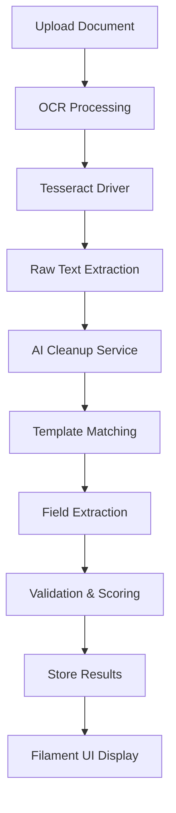

# Laravel Smart OCR Integration Guide

## Overview

Laravel Smart OCR is a powerful OCR (Optical Character Recognition) and document parsing engine that extracts structured data from images and PDFs. It combines Tesseract OCR with AI-powered cleanup for accurate data extraction.

**Key Features:**
- Template-based document parsing
- AI-powered text cleanup and normalization
- Support for multiple document types (invoices, receipts, business cards, contracts)
- Filament v4.3+ admin interface integration
- Queue-based processing for large documents
- Confidence scoring and validation
- Multi-language support via Tesseract

## Architecture



## Installation

### 1. Install Package

```bash
composer require laravelsmartocr/laravel-smart-ocr
```

### 2. Install Tesseract OCR

**macOS:**
```bash
brew install tesseract
brew install tesseract-lang  # For additional languages
```

**Ubuntu/Debian:**
```bash
sudo apt-get update
sudo apt-get install tesseract-ocr
sudo apt-get install tesseract-ocr-eng  # English
sudo apt-get install tesseract-ocr-all  # All languages
```

**Windows:**
Download from: https://github.com/UB-Mannheim/tesseract/wiki

### 3. Publish Configuration

```bash
php artisan vendor:publish --tag=smart-ocr-config
php artisan vendor:publish --tag=smart-ocr-migrations
php artisan vendor:publish --tag=smart-ocr-views
```

### 4. Run Migrations

```bash
php artisan migrate
```

## Configuration

### Environment Variables

Add to `.env`:

```env
# OCR Configuration
SMART_OCR_DRIVER=tesseract
SMART_OCR_TESSERACT_PATH=/usr/local/bin/tesseract
SMART_OCR_TESSERACT_LANG=eng
SMART_OCR_TEMP_PATH=storage/app/ocr/temp
SMART_OCR_OUTPUT_PATH=storage/app/ocr/output

# AI Cleanup (Optional - uses Prism PHP for local AI)
SMART_OCR_AI_ENABLED=true
SMART_OCR_AI_MODEL=gpt-4
SMART_OCR_AI_TEMPERATURE=0.3

# Processing
SMART_OCR_QUEUE_ENABLED=true
SMART_OCR_QUEUE_CONNECTION=database
SMART_OCR_QUEUE_NAME=ocr-processing

# Validation
SMART_OCR_MIN_CONFIDENCE=0.7
SMART_OCR_MAX_FILE_SIZE=10240  # KB
SMART_OCR_ALLOWED_EXTENSIONS=pdf,png,jpg,jpeg,tiff
```

### Config File

The published `config/smart-ocr.php` contains:

```php
return [
    'driver' => env('SMART_OCR_DRIVER', 'tesseract'),
    
    'drivers' => [
        'tesseract' => [
            'path' => env('SMART_OCR_TESSERACT_PATH', '/usr/local/bin/tesseract'),
            'lang' => env('SMART_OCR_TESSERACT_LANG', 'eng'),
            'psm' => env('SMART_OCR_TESSERACT_PSM', 3),
            'oem' => env('SMART_OCR_TESSERACT_OEM', 3),
        ],
    ],
    
    'ai_cleanup' => [
        'enabled' => env('SMART_OCR_AI_ENABLED', true),
        'model' => env('SMART_OCR_AI_MODEL', 'gpt-4'),
        'temperature' => env('SMART_OCR_AI_TEMPERATURE', 0.3),
        'max_tokens' => env('SMART_OCR_AI_MAX_TOKENS', 2000),
    ],
    
    'paths' => [
        'temp' => storage_path('app/ocr/temp'),
        'output' => storage_path('app/ocr/output'),
    ],
    
    'queue' => [
        'enabled' => env('SMART_OCR_QUEUE_ENABLED', true),
        'connection' => env('SMART_OCR_QUEUE_CONNECTION', 'database'),
        'queue' => env('SMART_OCR_QUEUE_NAME', 'ocr-processing'),
    ],
    
    'validation' => [
        'min_confidence' => env('SMART_OCR_MIN_CONFIDENCE', 0.7),
        'max_file_size' => env('SMART_OCR_MAX_FILE_SIZE', 10240),
        'allowed_extensions' => explode(',', env('SMART_OCR_ALLOWED_EXTENSIONS', 'pdf,png,jpg,jpeg,tiff')),
    ],
];
```

## Database Schema

### Tables Created

**1. `smart_ocr_templates`**
- Stores document templates (invoice, receipt, etc.)
- Fields: name, description, document_type, field_definitions, validation_rules

**2. `smart_ocr_template_fields`**
- Defines extractable fields for each template
- Fields: template_id, field_name, field_type, extraction_pattern, required, validation_rules

**3. `smart_ocr_processed_documents`**
- Stores processed document results
- Fields: template_id, file_path, extracted_data, confidence_score, status, processing_time

## Core Services

### 1. OCRManager

Main service for OCR operations:

```php
use LaravelSmartOCR\Services\OCRManager;

$ocrManager = app(OCRManager::class);

// Process a document
$result = $ocrManager->process('/path/to/document.pdf');

// Get extracted text
$text = $result->getText();

// Get confidence score
$confidence = $result->getConfidence();
```

### 2. DocumentParser

Parses documents using templates:

```php
use LaravelSmartOCR\Services\DocumentParser;

$parser = app(DocumentParser::class);

// Parse with template
$data = $parser->parseWithTemplate($filePath, $templateId);

// Auto-detect template
$data = $parser->parseAuto($filePath);
```

### 3. TemplateManager

Manages document templates:

```php
use LaravelSmartOCR\Services\TemplateManager;

$templateManager = app(TemplateManager::class);

// Create template
$template = $templateManager->create([
    'name' => 'Invoice Template',
    'document_type' => 'invoice',
    'field_definitions' => [
        'invoice_number' => ['type' => 'string', 'required' => true],
        'date' => ['type' => 'date', 'required' => true],
        'total' => ['type' => 'decimal', 'required' => true],
    ],
]);

// Add fields
$templateManager->addField($template->id, [
    'field_name' => 'invoice_number',
    'field_type' => 'string',
    'extraction_pattern' => '/Invoice\s*#?\s*:?\s*(\w+)/i',
    'required' => true,
]);
```

### 4. AICleanupService

Cleans and normalizes extracted text:

```php
use LaravelSmartOCR\Services\AICleanupService;

$aiService = app(AICleanupService::class);

// Clean raw OCR text
$cleanedText = $aiService->cleanup($rawText);

// Extract structured data
$structuredData = $aiService->extractStructuredData($text, $template);
```

## Usage Examples

### Basic Document Processing

```php
use LaravelSmartOCR\Facades\SmartOCR;

// Simple text extraction
$text = SmartOCR::extractText('/path/to/document.pdf');

// Process with template
$data = SmartOCR::processDocument('/path/to/invoice.pdf', 'invoice-template');

// Result structure
[
    'success' => true,
    'data' => [
        'invoice_number' => 'INV-2024-001',
        'date' => '2024-01-15',
        'total' => 1250.00,
        'items' => [...]
    ],
    'confidence' => 0.95,
    'processing_time' => 2.3,
]
```

### Queue-Based Processing

```php
use LaravelSmartOCR\Jobs\ProcessDocumentJob;

// Dispatch to queue
ProcessDocumentJob::dispatch($filePath, $templateId, $userId);

// With callback
ProcessDocumentJob::dispatch($filePath, $templateId, $userId)
    ->onSuccess(function ($result) {
        // Handle success
    })
    ->onFailure(function ($exception) {
        // Handle failure
    });
```

### Creating Custom Templates

```php
use LaravelSmartOCR\Models\DocumentTemplate;
use LaravelSmartOCR\Models\TemplateField;

// Create invoice template
$template = DocumentTemplate::create([
    'name' => 'Standard Invoice',
    'description' => 'Template for standard invoices',
    'document_type' => 'invoice',
    'field_definitions' => [
        'invoice_number' => [
            'type' => 'string',
            'required' => true,
            'validation' => 'regex:/^INV-\d{4}-\d{3}$/',
        ],
        'date' => [
            'type' => 'date',
            'required' => true,
            'format' => 'Y-m-d',
        ],
        'total' => [
            'type' => 'decimal',
            'required' => true,
            'min' => 0,
        ],
    ],
]);

// Add extraction fields
TemplateField::create([
    'template_id' => $template->id,
    'field_name' => 'invoice_number',
    'field_type' => 'string',
    'extraction_pattern' => '/Invoice\s*#?\s*:?\s*(\w+-\d+-\d+)/i',
    'required' => true,
    'validation_rules' => ['regex:/^INV-\d{4}-\d{3}$/'],
]);
```

## Filament v4.3+ Integration

### Resource for Document Templates

```php
// app/Filament/Resources/DocumentTemplateResource.php
namespace App\Filament\Resources;

use App\Filament\Resources\DocumentTemplateResource\Pages;
use Filament\Forms;
use Filament\Forms\Form;
use Filament\Resources\Resource;
use Filament\Tables;
use Filament\Tables\Table;
use LaravelSmartOCR\Models\DocumentTemplate;

class DocumentTemplateResource extends Resource
{
    protected static ?string $model = DocumentTemplate::class;
    
    protected static ?string $navigationIcon = 'heroicon-o-document-text';
    
    protected static ?string $navigationGroup = 'OCR Management';
    
    public static function form(Form $form): Form
    {
        return $form
            ->schema([
                Forms\Components\Section::make('Template Details')
                    ->schema([
                        Forms\Components\TextInput::make('name')
                            ->required()
                            ->maxLength(255),
                        
                        Forms\Components\Select::make('document_type')
                            ->options([
                                'invoice' => 'Invoice',
                                'receipt' => 'Receipt',
                                'business_card' => 'Business Card',
                                'contract' => 'Contract',
                                'shipping_label' => 'Shipping Label',
                                'custom' => 'Custom',
                            ])
                            ->required(),
                        
                        Forms\Components\Textarea::make('description')
                            ->rows(3)
                            ->columnSpanFull(),
                    ]),
                
                Forms\Components\Section::make('Field Definitions')
                    ->schema([
                        Forms\Components\KeyValue::make('field_definitions')
                            ->keyLabel('Field Name')
                            ->valueLabel('Configuration')
                            ->reorderable()
                            ->columnSpanFull(),
                    ]),
            ]);
    }
    
    public static function table(Table $table): Table
    {
        return $table
            ->columns([
                Tables\Columns\TextColumn::make('name')
                    ->searchable()
                    ->sortable(),
                
                Tables\Columns\TextColumn::make('document_type')
                    ->badge()
                    ->color(fn (string $state): string => match ($state) {
                        'invoice' => 'success',
                        'receipt' => 'info',
                        'contract' => 'warning',
                        default => 'gray',
                    }),
                
                Tables\Columns\TextColumn::make('fields_count')
                    ->counts('fields')
                    ->label('Fields'),
                
                Tables\Columns\TextColumn::make('created_at')
                    ->dateTime()
                    ->sortable()
                    ->toggleable(),
            ])
            ->filters([
                Tables\Filters\SelectFilter::make('document_type')
                    ->options([
                        'invoice' => 'Invoice',
                        'receipt' => 'Receipt',
                        'business_card' => 'Business Card',
                        'contract' => 'Contract',
                    ]),
            ])
            ->actions([
                Tables\Actions\EditAction::make(),
                Tables\Actions\DeleteAction::make(),
            ])
            ->bulkActions([
                Tables\Actions\BulkActionGroup::make([
                    Tables\Actions\DeleteBulkAction::make(),
                ]),
            ]);
    }
    
    public static function getRelations(): array
    {
        return [
            //
        ];
    }
    
    public static function getPages(): array
    {
        return [
            'index' => Pages\ListDocumentTemplates::route('/'),
            'create' => Pages\CreateDocumentTemplate::route('/create'),
            'edit' => Pages\EditDocumentTemplate::route('/{record}/edit'),
        ];
    }
}
```

### Resource for Processed Documents

```php
// app/Filament/Resources/ProcessedDocumentResource.php
namespace App\Filament\Resources;

use App\Filament\Resources\ProcessedDocumentResource\Pages;
use Filament\Forms;
use Filament\Forms\Form;
use Filament\Resources\Resource;
use Filament\Tables;
use Filament\Tables\Table;
use LaravelSmartOCR\Models\ProcessedDocument;

class ProcessedDocumentResource extends Resource
{
    protected static ?string $model = ProcessedDocument::class;
    
    protected static ?string $navigationIcon = 'heroicon-o-document-check';
    
    protected static ?string $navigationGroup = 'OCR Management';
    
    public static function form(Form $form): Form
    {
        return $form
            ->schema([
                Forms\Components\Section::make('Document Information')
                    ->schema([
                        Forms\Components\Select::make('template_id')
                            ->relationship('template', 'name')
                            ->required(),
                        
                        Forms\Components\FileUpload::make('file_path')
                            ->label('Document')
                            ->disk('local')
                            ->directory('ocr/uploads')
                            ->acceptedFileTypes(['application/pdf', 'image/*'])
                            ->maxSize(10240)
                            ->required(),
                        
                        Forms\Components\Select::make('status')
                            ->options([
                                'pending' => 'Pending',
                                'processing' => 'Processing',
                                'completed' => 'Completed',
                                'failed' => 'Failed',
                            ])
                            ->default('pending'),
                    ]),
                
                Forms\Components\Section::make('Extracted Data')
                    ->schema([
                        Forms\Components\KeyValue::make('extracted_data')
                            ->columnSpanFull(),
                        
                        Forms\Components\TextInput::make('confidence_score')
                            ->numeric()
                            ->minValue(0)
                            ->maxValue(1)
                            ->step(0.01)
                            ->suffix('%')
                            ->disabled(),
                        
                        Forms\Components\TextInput::make('processing_time')
                            ->numeric()
                            ->suffix('seconds')
                            ->disabled(),
                    ])
                    ->visible(fn ($record) => $record && $record->status === 'completed'),
            ]);
    }
    
    public static function table(Table $table): Table
    {
        return $table
            ->columns([
                Tables\Columns\TextColumn::make('template.name')
                    ->searchable()
                    ->sortable(),
                
                Tables\Columns\TextColumn::make('status')
                    ->badge()
                    ->color(fn (string $state): string => match ($state) {
                        'pending' => 'gray',
                        'processing' => 'warning',
                        'completed' => 'success',
                        'failed' => 'danger',
                    }),
                
                Tables\Columns\TextColumn::make('confidence_score')
                    ->label('Confidence')
                    ->formatStateUsing(fn ($state) => $state ? number_format($state * 100, 1) . '%' : '—')
                    ->sortable(),
                
                Tables\Columns\TextColumn::make('processing_time')
                    ->label('Time')
                    ->formatStateUsing(fn ($state) => $state ? number_format($state, 2) . 's' : '—')
                    ->sortable(),
                
                Tables\Columns\TextColumn::make('created_at')
                    ->dateTime()
                    ->sortable()
                    ->toggleable(),
            ])
            ->filters([
                Tables\Filters\SelectFilter::make('status')
                    ->options([
                        'pending' => 'Pending',
                        'processing' => 'Processing',
                        'completed' => 'Completed',
                        'failed' => 'Failed',
                    ]),
                
                Tables\Filters\SelectFilter::make('template')
                    ->relationship('template', 'name'),
            ])
            ->actions([
                Tables\Actions\Action::make('reprocess')
                    ->icon('heroicon-o-arrow-path')
                    ->action(function (ProcessedDocument $record) {
                        // Reprocess logic
                    })
                    ->visible(fn (ProcessedDocument $record) => $record->status === 'failed'),
                
                Tables\Actions\ViewAction::make(),
                Tables\Actions\DeleteAction::make(),
            ])
            ->bulkActions([
                Tables\Actions\BulkActionGroup::make([
                    Tables\Actions\DeleteBulkAction::make(),
                ]),
            ]);
    }
    
    public static function getRelations(): array
    {
        return [
            //
        ];
    }
    
    public static function getPages(): array
    {
        return [
            'index' => Pages\ListProcessedDocuments::route('/'),
            'create' => Pages\CreateProcessedDocument::route('/create'),
            'view' => Pages\ViewProcessedDocument::route('/{record}'),
        ];
    }
}
```

## Service Integration

### Register Services in AppServiceProvider

```php
// app/Providers/AppServiceProvider.php
use LaravelSmartOCR\Services\OCRManager;
use LaravelSmartOCR\Services\DocumentParser;
use LaravelSmartOCR\Services\TemplateManager;
use LaravelSmartOCR\Services\AICleanupService;

public function register(): void
{
    // Singleton for OCR Manager
    $this->app->singleton(OCRManager::class, function ($app) {
        return new OCRManager(
            config('smart-ocr.driver'),
            config('smart-ocr.drivers')
        );
    });
    
    // Singleton for Document Parser
    $this->app->singleton(DocumentParser::class, function ($app) {
        return new DocumentParser(
            $app->make(OCRManager::class),
            $app->make(TemplateManager::class),
            $app->make(AICleanupService::class)
        );
    });
    
    // Singleton for Template Manager
    $this->app->singleton(TemplateManager::class);
    
    // Singleton for AI Cleanup Service
    $this->app->singleton(AICleanupService::class, function ($app) {
        return new AICleanupService(
            config('smart-ocr.ai_cleanup')
        );
    });
}
```

## Testing

### Feature Tests

```php
// tests/Feature/OCR/DocumentProcessingTest.php
use LaravelSmartOCR\Facades\SmartOCR;
use LaravelSmartOCR\Models\DocumentTemplate;
use LaravelSmartOCR\Models\ProcessedDocument;

it('can extract text from PDF document', function () {
    $filePath = storage_path('app/testing/sample-invoice.pdf');
    
    $text = SmartOCR::extractText($filePath);
    
    expect($text)->toBeString()
        ->and($text)->not->toBeEmpty();
});

it('can process document with template', function () {
    $template = DocumentTemplate::factory()->create([
        'document_type' => 'invoice',
    ]);
    
    $filePath = storage_path('app/testing/sample-invoice.pdf');
    
    $result = SmartOCR::processDocument($filePath, $template->id);
    
    expect($result['success'])->toBeTrue()
        ->and($result['data'])->toBeArray()
        ->and($result['confidence'])->toBeGreaterThan(0.7);
});

it('stores processed document in database', function () {
    $template = DocumentTemplate::factory()->create();
    $filePath = storage_path('app/testing/sample-invoice.pdf');
    
    SmartOCR::processDocument($filePath, $template->id);
    
    expect(ProcessedDocument::count())->toBe(1);
    
    $document = ProcessedDocument::first();
    expect($document->status)->toBe('completed')
        ->and($document->extracted_data)->toBeArray();
});
```

### Unit Tests

```php
// tests/Unit/OCR/OCRManagerTest.php
use LaravelSmartOCR\Services\OCRManager;

it('initializes OCR manager with correct driver', function () {
    $manager = app(OCRManager::class);
    
    expect($manager)->toBeInstanceOf(OCRManager::class);
});

it('processes image and returns text', function () {
    $manager = app(OCRManager::class);
    $imagePath = storage_path('app/testing/sample-image.png');
    
    $result = $manager->process($imagePath);
    
    expect($result->getText())->toBeString()
        ->and($result->getConfidence())->toBeFloat();
});
```

## Performance Optimization

### 1. Queue Processing

```php
// config/queue.php
'connections' => [
    'ocr-processing' => [
        'driver' => 'database',
        'table' => 'jobs',
        'queue' => 'ocr',
        'retry_after' => 300,
        'after_commit' => false,
    ],
],
```

### 2. Caching Templates

```php
use Illuminate\Support\Facades\Cache;

$template = Cache::remember(
    "ocr-template-{$templateId}",
    3600,
    fn () => DocumentTemplate::with('fields')->find($templateId)
);
```

### 3. Batch Processing

```php
use Illuminate\Bus\Batch;
use Illuminate\Support\Facades\Bus;
use LaravelSmartOCR\Jobs\ProcessDocumentJob;

$batch = Bus::batch([
    new ProcessDocumentJob($file1, $templateId),
    new ProcessDocumentJob($file2, $templateId),
    new ProcessDocumentJob($file3, $templateId),
])->then(function (Batch $batch) {
    // All jobs completed successfully
})->catch(function (Batch $batch, Throwable $e) {
    // First batch job failure
})->finally(function (Batch $batch) {
    // Batch has finished executing
})->dispatch();
```

## Best Practices

### DO:
- ✅ Use queue-based processing for large documents
- ✅ Validate file types and sizes before processing
- ✅ Cache frequently used templates
- ✅ Set appropriate confidence thresholds
- ✅ Log processing errors with context
- ✅ Use AI cleanup for better accuracy
- ✅ Test with various document qualities
- ✅ Monitor processing times and optimize

### DON'T:
- ❌ Process large files synchronously
- ❌ Skip validation on uploaded files
- ❌ Ignore confidence scores
- ❌ Hardcode extraction patterns
- ❌ Forget to handle OCR failures
- ❌ Process without templates for structured data
- ❌ Skip testing with real-world documents

## Troubleshooting

### Tesseract Not Found

```bash
# Check Tesseract installation
which tesseract

# Update path in .env
SMART_OCR_TESSERACT_PATH=/usr/local/bin/tesseract
```

### Low Confidence Scores

- Improve image quality (resolution, contrast)
- Use AI cleanup service
- Adjust Tesseract PSM/OEM settings
- Create more specific extraction patterns

### Processing Timeouts

- Enable queue processing
- Increase timeout limits
- Process smaller batches
- Optimize template patterns

## Related Documentation

- `docs/laravel-container-services.md` - Service pattern integration
- `docs/filament-resources.md` - Filament resource patterns
- `docs/testing-infrastructure.md` - Testing guidelines
- `.kiro/steering/laravel-conventions.md` - Laravel conventions
- `.kiro/steering/filament-conventions.md` - Filament conventions

## References

- Package Repository: https://github.com/niravpatel143/laravel-smart-ocr-package
- Tesseract Documentation: https://tesseract-ocr.github.io/
- Filament Documentation: https://filamentphp.com/docs
